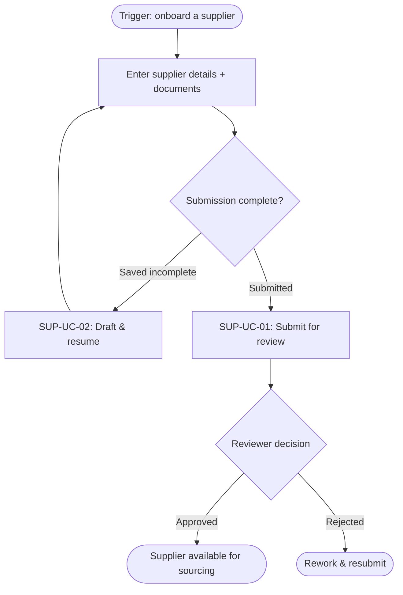
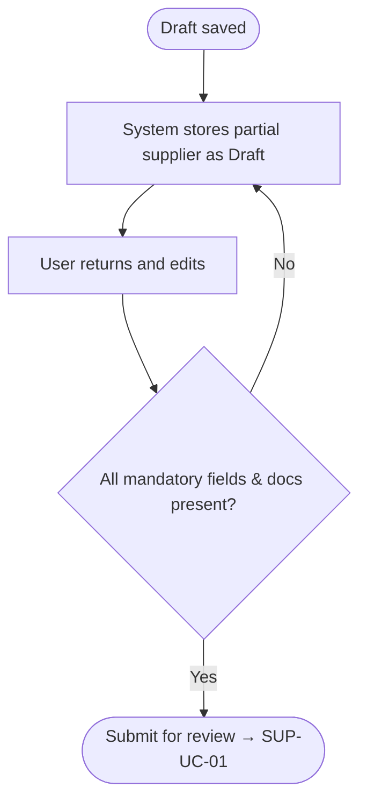

# Feature file templates

The exact schema for the feature index and for each of the seven files in a feature folder. Build every file from these so the `context/features/` tree stays uniform, traceable, and machine-parseable. Fill sections from the scope and the BA registers; where a section has no supported content, write the labelled placeholder (usually `None identified yet` or `TBD`) — **never delete a heading, never invent content**.

Folder names are **lowercase kebab-case** (`supplier-onboarding`, `outlet-discovery`). Every feature folder contains all seven files, even when a section is empty.

Feature IDs are stable and append-only: `FEAT-<AREA>-NN` where `<AREA>` is a short uppercase abbreviation for the capability area (Supplier → `SUP`, Sourcing → `SRC`, RFP → `RFP`) and `NN` is sequential within that area. New open questions minted here use `OQ-<AREA>-NN`; where a question is already tracked in the BA `clarification-log.md`, reuse its `CLR-###` id instead of minting a new one.

Every feature also carries an **`initiative`** — the human-named work-batch slug (e.g. `payments-v2`) passed to `/ba:features initiative=<name>`, so a developer can later plan and build just the features from their own scoping effort even when the shared `context/features/` holds many developers' in-flight features (see `delivery-os-conventions` §3). It is written to the `initiative:` frontmatter of `feature.md` and `status.md`, and to the `Initiative` column of `feature-index.md`. On a re-run an existing feature **keeps** its initiative unless a new one is passed; a feature with none is `unassigned`.

---

## feature-index.md

`context/features/feature-index.md` — the map of the whole breakdown. One row per feature. On re-runs, update in place; keep retired features visible with a status (`Merged into …`, `Deferred`, `Removed`) rather than deleting the row.

```md
---
doc_type: feature-index
schema_version: 1.1
produced_by: ba
status: Emerging
generated_at: YYYY-MM-DD
---

# Feature Index

| Feature ID | Feature | Initiative | Status | Priority | Dependencies | Folder |
|---|---|---|---|---|---|---|
| FEAT-SUP-001 | Supplier Onboarding | supplier-portal | Ready for Planning | High | User Management, Document Storage | ./supplier-onboarding |
| FEAT-SUP-002 | Supplier Approval Workflow | supplier-portal | Proposed | High | Supplier Onboarding, Notification Service | ./supplier-approval |
| FEAT-SRC-001 | Outlet Discovery | sourcing-mvp | Proposed | High | Supplier Onboarding, Outlet Data | ./outlet-discovery |
| FEAT-RFP-001 | RFP Generation | sourcing-mvp | Proposed | Medium | Outlet Discovery, Notification Service | ./rfp-generation |
```

**Status** (controlled values, shared with `feature.md` and `status.md`): `Proposed` · `Ready for Planning` · `In Development` · `In QA` · `UAT` · `Released` · `Blocked` (plus the retirement values above). **Priority**: `High` · `Medium` · `Low`. **Initiative**: the human-named work-batch slug the feature was scoped under (`unassigned` if none) — the grouping `/tl:plan` and `/dev:build` filter by.

---

## 1. feature.md

The primary business and product context — enough to understand the feature without reading the scope. Every fact traces back via **Source References**.

```md
---
doc_type: feature
schema_version: 1.1
produced_by: ba
feature_id: FEAT-SUP-001
initiative: supplier-portal
use_cases: [SUP-UC-01, SUP-UC-02]
status: Ready for Planning
generated_at: YYYY-MM-DD
---

# Feature: Supplier Onboarding

## Feature ID
FEAT-SUP-001

## Initiative
supplier-portal

## Status
Proposed | Ready for Planning | In Development | In QA | UAT | Released | Blocked

## Summary
Allow internal users to create and manage supplier profiles before the supplier can participate in sourcing workflows.

## Business Objective
Reduce manual supplier onboarding through email, spreadsheets, and disconnected internal tools.

## Business Problem Solved
The current process requires operations teams to manually gather supplier information, validate documents, track approval status, and coordinate with compliance teams.

## Users
- Operations Coordinator
- Supplier Manager
- Compliance Reviewer
- Finance Reviewer
- System Administrator

## User Value
- Faster supplier setup
- Reduced manual follow-up
- Clear approval visibility
- Better compliance tracking
- Consistent supplier information

## In Scope
- Create supplier profile
- Add supplier contacts
- Upload compliance documents
- Validate mandatory fields
- Submit supplier for review
- Track onboarding status
- View approval history

## Out of Scope
- Supplier contract generation
- Supplier payment setup
- Supplier performance scoring

## Use Cases Covered
The scope use cases (§3.x.4) this feature realises — each becomes a flow in `workflow.md`:
- SUP-UC-01 — Submit supplier for review
- SUP-UC-02 — Draft & resume

## Related Business Workflows
- Supplier Onboarding
- Supplier Approval
- Supplier Compliance Review

## Related Pages
- Supplier List Page
- Create Supplier Page
- Supplier Details Page
- Supplier Approval Queue

## Related APIs / Services
- POST /suppliers
- GET /suppliers/{supplierId}
- PUT /suppliers/{supplierId}
- POST /suppliers/{supplierId}/submit-for-review
- POST /suppliers/{supplierId}/documents

## Related Data Entities
- suppliers
- supplier_contacts
- supplier_documents
- supplier_status_history
- audit_log

## Related Integrations
- Document storage provider
- CRM
- Notification service

## Dependencies
- User and Role Management
- Document Upload Capability
- Notification Service

## Assumptions
- Supplier onboarding will be performed by internal users.
- Mandatory compliance documents will be configurable.
- Supplier records must support draft status before submission.

## Open Questions
- Who can approve suppliers?
- What are the mandatory document types?
- Is finance approval required for every supplier?
- Are suppliers allowed to update their own profile?

## Source References
- Scope Document: §3.2 Supplier Management (§3.2.4 Use Cases SUP-UC-01, SUP-UC-02)
- Use Case Register: SUP-UC-01, SUP-UC-02
- Requirement Register: SUP-FR-01, SUP-FR-02
- Discovery Notes: Supplier Intake Workshop, June 2026 [SRC-004 › meeting-transcripts/2026-06-…]
```

Notes:
- **Related APIs / Pages / Data Entities / Integrations** are *expectations implied by the scope*, not confirmed contracts. Where a context file already defines the real thing, link to it instead (Rule 3), e.g. `../../backend/domains/supplier/endpoints/create-supplier.md` — the units the TL's `tl-feature-planning` skill creates.
- **Open Questions** here is a human-readable summary; the authoritative, owned list is `open-questions.md`.
- **Source References** are required — every feature must trace to a scope §, a register ID, and/or a `[SRC-### › original]` citation.

---

## 2. implementation-plan.md

How the feature breaks into buildable **work areas** — not code. No low-level implementation instructions unless the technical design has already confirmed them.

```md
---
doc_type: implementation-plan
schema_version: 1.1
produced_by: ba
feature_id: FEAT-SUP-001
generated_at: YYYY-MM-DD
---

# Implementation Plan: Supplier Onboarding

## Implementation Goal
Enable internal teams to create, validate, review, and submit supplier profiles for approval.

## Proposed Build Areas

### 1. Supplier Profile Management
Users can create, edit, save, and view supplier profiles.

Expected pages:
- Supplier List Page
- Create Supplier Page
- Supplier Details Page

Expected backend capabilities:
- Create supplier
- Retrieve supplier
- Update supplier
- Search suppliers

Expected data entities:
- suppliers
- supplier_contacts

### 2. Supplier Document Management
Users can upload and manage compliance documents.

Expected pages:
- Supplier Details Page
- Document Upload Modal

Expected backend capabilities:
- Upload supplier document
- Retrieve supplier documents
- Validate document metadata
- Delete or replace document

Expected data entities:
- supplier_documents

Expected integrations:
- File storage service

### 3. Supplier Review Submission
Users can submit a supplier for review once all required fields are complete.

Expected backend capabilities:
- Validate onboarding completeness
- Change supplier status
- Record status history
- Notify reviewers

Expected data entities:
- suppliers
- supplier_status_history
- audit_log

### 4. Approval Queue
Approvers can review pending suppliers and approve or reject them.

Expected pages:
- Supplier Approval Queue
- Supplier Details Page

Expected backend capabilities:
- Retrieve suppliers pending review
- Approve supplier
- Reject supplier
- Record approval decision

## Suggested Delivery Sequence
1. Supplier data model and basic profile management
2. Supplier list and detail pages
3. Document upload and validation
4. Submit-for-review workflow
5. Approval queue and decision workflow
6. Notifications and audit history
7. QA, UAT, and edge-case validation

## Technical Considerations
- Supplier status transitions must be controlled through backend validation.
- Approval actions must be auditable.
- File uploads must be linked to the correct supplier record.
- Role-based access must be enforced for approval actions.
- Supplier records should support draft saving.

## Potential Risks
- Mandatory document rules are not yet confirmed.
- Approval workflow may differ by supplier type or geography.
- Existing supplier data may require migration or cleanup.

## Implementation Readiness
Ready | Partially Ready | Not Ready

## Blocking Items
- Approval matrix confirmation
- Mandatory document list
- Document storage integration confirmation
```

---

## 3. workflow.md

The end-to-end business journey. Starts with an **overview flow** (Mermaid, seeded from the module master flow §3.x.3), then the primary flow, then one **alternative flow per use case** the feature covers — each carrying its own Mermaid diagram and, where the scope has one, a worked example. Author diagrams as Mermaid `flowchart` blocks (`delivery-os-conventions` §8); the Doc Agent renders the branded SVG swimlane from them. *(Template shown with a four-backtick outer fence so the inner ```mermaid blocks nest cleanly.)*

````md
---
doc_type: feature-workflow
schema_version: 1.1
produced_by: ba
feature_id: FEAT-SUP-001
use_cases: [SUP-UC-01, SUP-UC-02]
generated_at: YYYY-MM-DD
---

# Workflow: Supplier Onboarding

## Trigger
An internal operations user needs to onboard a new supplier.

## Overview Flow
The routes this feature covers and where they branch (seeded from scope §3.x.3; each branch names the use case it runs).



## Primary Flow
1. User opens the Supplier List Page.
2. User selects Create Supplier.
3. User enters supplier company information.
4. User adds supplier contacts.
5. User uploads mandatory compliance documents.
6. System validates required fields and required documents.
7. User saves the supplier as Draft or submits it for review.
8. System changes supplier status to Pending Review.
9. System notifies the assigned reviewer.
10. Reviewer opens the Supplier Approval Queue.
11. Reviewer approves or rejects the supplier.
12. System records the decision in audit history.
13. If approved, the supplier becomes available for sourcing workflows.

## Alternative Flows
One sub-section per **use case / route** the feature covers (from scope §3.x.4). Where a route is materially distinct — different steps, actors, rules, systems, or outcome — give it its own Mermaid diagram and reuse the use case's worked example; a minor variation (draft, missing-field) can stay prose.

### SUP-UC-02 — Draft & resume  ·  *route: submission saved incomplete*
The user saves incomplete supplier information as Draft and completes it later.



*Worked example:* Draft `SUP-DRAFT-118` saved with company info but no compliance docs; completed two days later and submitted. `[EX-021]`

### Missing Mandatory Documents  *(minor variation of SUP-UC-01)*
The system prevents submission and displays the missing document requirements.

### Rejection / Rework  *(reviewer path of SUP-UC-01)*
The reviewer rejects with a reason; the operations user updates the profile and resubmits.

## Business Rules
- Only users with relevant permissions can submit suppliers for review.
- Only authorized approvers can approve or reject suppliers.
- Rejection requires a reason.
- Supplier cannot be used in sourcing until status is Approved.
- Approval history must not be editable.

## Related Features
- Supplier Approval Workflow (FEAT-SUP-002)
- Notification Center
- Audit History
````

Cite the source use-case / workflow / business-rule register IDs (`<MODULE>-UC-##`, `WF-###`, `BR-###`) inline where they exist. The `use_cases:` frontmatter lists every scope use case this feature realises, so traceability runs scope §3.x.4 → feature 1:1.

---

## 4. acceptance-criteria.md

Testable, capability-level outcomes — what "done" means for the business, grouped by area and tied to the requirements. Not detailed test specs.

```md
---
doc_type: acceptance-criteria
schema_version: 1.1
produced_by: ba
feature_id: FEAT-SUP-001
generated_at: YYYY-MM-DD
---

# Acceptance Criteria: Supplier Onboarding

## Supplier Creation
- A user can create a supplier profile with required company information.
- A supplier profile can be saved as Draft.
- Draft suppliers are not visible in sourcing workflows.
- Duplicate supplier validation is performed based on configured business rules.

## Document Management
- A user can upload mandatory supplier documents.
- Uploaded documents are associated with the correct supplier.
- The system identifies missing mandatory document types.
- Users can replace expired or incorrect documents.

## Submission for Review
- A user can submit a supplier only when required fields and documents are complete.
- Submission changes the supplier status to Pending Review.
- Submission creates a status-history record.
- Relevant reviewers receive a notification.

## Approval
- Authorized reviewers can approve or reject a supplier.
- Rejection requires a reason.
- Approval changes the supplier status to Approved.
- Approved suppliers become available for downstream sourcing workflows.
- Approval and rejection actions are recorded in audit history.

## Permissions
- Users without approval permission cannot approve or reject suppliers.
- Users without edit permission cannot modify supplier details.
```

---

## 5. dependencies.md

All upstream and downstream dependencies. Record cross-feature dependencies in *both* features' files and in the index.

```md
---
doc_type: feature-dependencies
schema_version: 1.1
produced_by: ba
feature_id: FEAT-SUP-001
generated_at: YYYY-MM-DD
---

# Dependencies: Supplier Onboarding

## Upstream Dependencies
- User authentication
- Role and permission management
- Document storage service
- Notification service

## Downstream Dependencies
- Supplier Approval Workflow (FEAT-SUP-002)
- Outlet Discovery (FEAT-SRC-001)
- RFP Generation (FEAT-RFP-001)
- Contract Generation
- Supplier Reporting

## Data Dependencies
- suppliers
- supplier_contacts
- supplier_documents
- supplier_status_history
- audit_log

## Integration Dependencies
- CRM synchronization
- File storage provider
- Email or notification provider

## Dependency Risks
- CRM may have duplicate supplier records.
- File storage provider may impose upload-size restrictions.
- Approval workflow may require region-specific rules.
```

---

## 6. open-questions.md

Unresolved decisions, captured without guessing. Reuse `CLR-###` ids for questions already logged in the BA `clarification-log.md`; mint `OQ-<AREA>-NN` for genuinely new ones. **An entry here must never be promoted into a confirmed requirement elsewhere.**

```md
---
doc_type: feature-open-questions
schema_version: 1.1
produced_by: ba
feature_id: FEAT-SUP-001
generated_at: YYYY-MM-DD
---

# Open Questions: Supplier Onboarding

| ID | Question | Owner | Impact | Status |
|---|---|---|---|---|
| OQ-SUP-001 | What document types are mandatory for onboarding? | Compliance Team | Blocks validation rules | Open |
| OQ-SUP-002 | Can suppliers update their own information through a portal? | Product Owner | Impacts user roles and UI scope | Open |
| OQ-SUP-003 | Does approval require one reviewer or multiple approval stages? | Operations Lead | Impacts workflow design | Open |
| OQ-SUP-004 | What defines a duplicate supplier? | Data Owner | Impacts validation logic | Open |
| OQ-SUP-005 | Should rejected suppliers be allowed to resubmit? | Product Owner | Impacts state transitions | Open |
```

**Status** values: `Open` · `Answered` · `Deferred` · `Won't-fix`. When an owner is unknown, write `Unassigned` — never invent one. When a question closes, record the answer's landing (a scope edit / decision) rather than deleting the row.

---

## 7. status.md

The operational tracker for the feature.

```md
---
doc_type: feature-status
schema_version: 1.1
produced_by: ba
feature_id: FEAT-SUP-001
initiative: supplier-portal
generated_at: YYYY-MM-DD
---

# Feature Status: Supplier Onboarding

## Current Status
Ready for Planning

## Feature Owner
Unassigned

## Technical Owner
Unassigned

## QA Owner
Unassigned

## Priority
High

## Target Release
TBD

## Development Progress

| Area | Status | Owner | Notes |
|---|---|---|---|
| Requirement Review | Complete | BA Agent | Initial feature context created |
| UX / Page Design | Not Started | Unassigned | Awaiting design direction |
| API Design | Not Started | Unassigned | Dependent on approval rules |
| Data Design | Not Started | Unassigned | Need document requirements |
| Development | Not Started | Unassigned | — |
| QA | Not Started | Unassigned | — |
| UAT | Not Started | Unassigned | — |

## Current Blockers
- Mandatory document list is not confirmed.
- Approval workflow is not confirmed.

## Last Updated
YYYY-MM-DD
```

**Current Status** uses the same controlled vocabulary as the index. **Development-progress Status** per row: `Not Started` · `In Progress` · `Complete` · `Blocked`.
