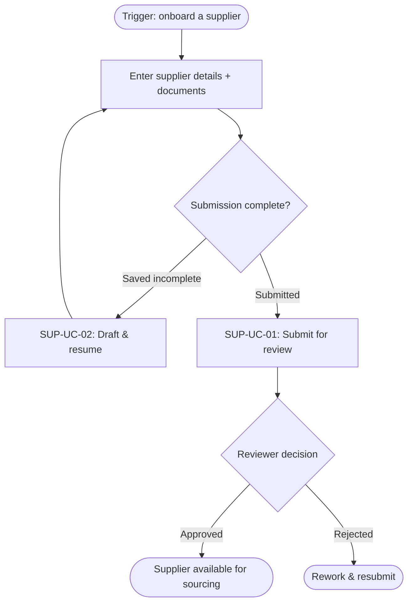

# Feature file templates

The exact schema for the feature index and for each of the ten files in a feature folder. Build every file from these so the `context/features/` tree stays uniform, traceable, and machine-parseable. Fill sections from the scope and the BA registers; where a section has no supported content, write the labelled placeholder (usually `None identified yet` or `TBD`) — **never delete a heading, never invent content**.

Folder names are **lowercase kebab-case** (`supplier-onboarding`, `outlet-discovery`). Every feature folder contains all ten files, even when a section is empty.

Feature IDs are stable and append-only: `FEAT-<AREA>-NN` where `<AREA>` is a short uppercase abbreviation for the capability area (Supplier → `SUP`, Sourcing → `SRC`, RFP → `RFP`) and `NN` is sequential within that area. New open questions minted here use `OQ-<AREA>-NN`; where a question is already tracked in the BA `clarification-log.md`, reuse its `CLR-###` id instead of minting a new one.

Every feature also carries an **`initiative`** — the human-named work-batch slug (e.g. `payments-v2`) passed to `/ba:features initiative=<name>`, so a developer can later plan and build just the features from their own scoping effort even when the shared `context/features/` holds many developers' in-flight features (see `delivery-os-conventions` §3). It is written to the `initiative:` frontmatter of `feature.md` and `status.md`, and to the `Initiative` column of `feature-index.md`. On a re-run an existing feature **keeps** its initiative unless a new one is passed; a feature with none is `unassigned`.

---

## feature-index.md

`context/features/feature-index.md` — the map of the whole breakdown. One row per feature. On re-runs, update in place; keep retired features visible with a status (`Merged into …`, `Deferred`, `Removed`) rather than deleting the row.

```md
---
doc_type: feature-index
schema_version: 1.1
produced_by: ba
status: Emerging
generated_at: YYYY-MM-DD
---

# Feature Index

| Feature ID | Feature | Initiative | Status | Priority | Dependencies | Folder |
|---|---|---|---|---|---|---|
| FEAT-SUP-001 | Supplier Onboarding | supplier-portal | Ready for Planning | High | User Management, Document Storage | ./supplier-onboarding |
| FEAT-SUP-002 | Supplier Approval Workflow | supplier-portal | Proposed | High | Supplier Onboarding, Notification Service | ./supplier-approval |
| FEAT-SRC-001 | Outlet Discovery | sourcing-mvp | Proposed | High | Supplier Onboarding, Outlet Data | ./outlet-discovery |
| FEAT-RFP-001 | RFP Generation | sourcing-mvp | Proposed | Medium | Outlet Discovery, Notification Service | ./rfp-generation |
```

**Status** (controlled values, shared with `feature.md` and `status.md`): `Proposed` · `Ready for Planning` · `In Development` · `In QA` · `UAT` · `Released` · `Blocked` (plus the retirement values above). **Priority**: `High` · `Medium` · `Low`. **Initiative**: the human-named work-batch slug the feature was scoped under (`unassigned` if none) — the grouping `/tl:plan` and `/dev:build` filter by.

---

## 1. feature.md  →  Description tab (merged with workflow.md at push)

Description-tab shape. Just three visible sections — **Objective**, **In Scope**, **Out of Scope**. Author them in that order locally; keep the three grouped together so a reviewer of the BA file sees the feature's story end-to-end.

**Push rearranges them.** The Description tab that appears in Jetrix reads in this order:

```
## Objective    (from feature.md)
## Workflow     (from workflow.md — bold-labelled flows + mermaid)
## In Scope     (from feature.md)
## Out of Scope (from feature.md)
```

The Workflow section is authored in `workflow.md` and injected between Objective and In Scope at push time. Placing scope AFTER workflow means AC and test-scenario rows can cite scope points naturally — "email notifications are out of scope, so a toast is shown" reads correctly when the reader has just seen the flow above and the scope statement immediately below.

Identity, initiative, status, use-case ids, cross-feature references, and any register / scope citations live in frontmatter — never in visible headings or prose.

```md
---
doc_type: feature
schema_version: 1.2
produced_by: ba
feature_id: FEAT-SUP-001
title: Supplier Onboarding
initiative: supplier-portal
slug: supplier-onboarding
list_name: "Supplier Management"        # optional — MC List this feature lands under; see resolution rule below
use_cases: [SUP-UC-01, SUP-UC-02]
status: Ready for Planning
priority: High
users: [operations-coordinator, supplier-manager, compliance-reviewer]
mapped_scope: "§3.2 Supplier Management"
mapped_requirements: [SUP-FR-01, SUP-FR-02]
mapped_sources: [SRC-004]
depends_on_features: [FEAT-USER-001, FEAT-DOC-001]
generated_at: YYYY-MM-DD
---

## Objective

Enable operations teams to create, validate, and submit supplier profiles for approval without manual email / spreadsheet handoffs, so a supplier can enter the sourcing workflow with a complete, auditable record.

## In Scope

- Create a supplier profile with mandatory company information.
- Add supplier contacts.
- Upload mandatory compliance documents.
- Validate mandatory fields before submission.
- Submit a supplier for review; status becomes Pending Review.
- Track onboarding status through Approved / Rejected outcome.
- View approval history for a supplier.

## Out of Scope

- Supplier contract generation.
- Supplier payment setup.
- Supplier performance scoring.
- Notifications to the requester once a decision is made — deliberately not built in this feature.
- Delegation, approval routing, or approver-role assignment.
```

**Rules for this file (enforced by the composer at push time):**

- **No visible headings other than `## Objective`, `## In Scope`, `## Out of Scope`.** Everything else (identity, users, use cases, dependencies, source references, provenance) lives in frontmatter.
- **No `# Feature: <title>` H1.** The MC task title comes from the `title:` frontmatter field — human-readable feature name, no `FEAT-…` prefix. Push reads this verbatim as `title`; the Description tab's own H1 is the task title MC renders separately.
- **No `## Related APIs / Related Pages / Related Data Entities`.** Those live in the TL context graph, not in BA output.
- **No `## Business Objective`, `## Business Problem Solved`, `## Summary`, `## User Value`, `## Users`, `## Assumptions`, `## Open Questions`.** The Objective section is the whole business-context allowance. Users is metadata (frontmatter). Assumptions and Open questions live in `dependencies.md` and `open-questions.md`.
- **Out-of-Scope must be explicit for items the reader might assume are in.** If notifications, escalations, or reporting are NOT built in this feature, name them explicitly — silent omission is worse than an explicit "no".
- **The Workflow section for the Description tab** is authored in `workflow.md` and merged in at push time. Do not include it here.
- **`list_name:` frontmatter is optional.** When present, that string is the MC List this feature's Task lands under (existing List → find; missing → create). When absent, push resolves the List name from `mapped_scope:` — strip the `§X.Y ` prefix and use the module label (`§3.2 Supplier Management` → `"Supplier Management"`). Falls back to `initiative:` if `mapped_scope:` is also missing, and finally to `solution_slug` so no feature is orphaned. Two features with the same `list_name` (or the same derived label) share a List. Set `list_name:` explicitly when you want to route this feature to a specific existing List or override the scope-module grouping.

---

## 2. implementation-plan.md

How the feature breaks into buildable **work areas** — not code. No low-level implementation instructions unless the technical design has already confirmed them.

```md
---
doc_type: implementation-plan
schema_version: 1.1
produced_by: ba
feature_id: FEAT-SUP-001
generated_at: YYYY-MM-DD
---

# Implementation Plan: Supplier Onboarding

## Implementation Goal
Enable internal teams to create, validate, review, and submit supplier profiles for approval.

## Proposed Build Areas

### 1. Supplier Profile Management
Users can create, edit, save, and view supplier profiles.

Expected pages:
- Supplier List Page
- Create Supplier Page
- Supplier Details Page

Expected backend capabilities:
- Create supplier
- Retrieve supplier
- Update supplier
- Search suppliers

Expected data entities:
- suppliers
- supplier_contacts

### 2. Supplier Document Management
Users can upload and manage compliance documents.

Expected pages:
- Supplier Details Page
- Document Upload Modal

Expected backend capabilities:
- Upload supplier document
- Retrieve supplier documents
- Validate document metadata
- Delete or replace document

Expected data entities:
- supplier_documents

Expected integrations:
- File storage service

### 3. Supplier Review Submission
Users can submit a supplier for review once all required fields are complete.

Expected backend capabilities:
- Validate onboarding completeness
- Change supplier status
- Record status history
- Notify reviewers

Expected data entities:
- suppliers
- supplier_status_history
- audit_log

### 4. Approval Queue
Approvers can review pending suppliers and approve or reject them.

Expected pages:
- Supplier Approval Queue
- Supplier Details Page

Expected backend capabilities:
- Retrieve suppliers pending review
- Approve supplier
- Reject supplier
- Record approval decision

## Suggested Delivery Sequence
1. Supplier data model and basic profile management
2. Supplier list and detail pages
3. Document upload and validation
4. Submit-for-review workflow
5. Approval queue and decision workflow
6. Notifications and audit history
7. QA, UAT, and edge-case validation

## Technical Considerations
- Supplier status transitions must be controlled through backend validation.
- Approval actions must be auditable.
- File uploads must be linked to the correct supplier record.
- Role-based access must be enforced for approval actions.
- Supplier records should support draft saving.

## Potential Risks
- Mandatory document rules are not yet confirmed.
- Approval workflow may differ by supplier type or geography.
- Existing supplier data may require migration or cleanup.

## Implementation Readiness
Ready | Partially Ready | Not Ready

## Blocking Items
- Approval matrix confirmation
- Mandatory document list
- Document storage integration confirmation
```

---

## 3. workflow.md  →  Description tab (concatenated after `## Objective / In Scope / Out of Scope` under a `## Workflow` heading push adds)

The end-to-end business journey as it will appear inside the Description tab's Workflow sub-section. **Body content only — no H1, no H2s.** Each flow variant is a **bold label** (`**Deciding a Pending request**`, `**Draft & resume**`), followed by numbered steps. A single Mermaid `flowchart` diagram covers the overall shape at the end (`delivery-os-conventions` §8); the Doc Agent renders the branded SVG from it. Use-case ids (`<MODULE>-UC-##`) and worked-example refs (`[EX-###]`) belong inline where they exist. *(Template shown with a four-backtick outer fence so the inner ```mermaid block nests cleanly.)*

````md
---
doc_type: feature-workflow
schema_version: 1.2
produced_by: ba
feature_id: FEAT-SUP-001
use_cases: [SUP-UC-01, SUP-UC-02]
mapped_workflows: [WF-021]
generated_at: YYYY-MM-DD
---

**Submitting a supplier for review**

1. User opens the Supplier List Page.
2. User selects Create Supplier.
3. User enters supplier company information and contacts.
4. User uploads mandatory compliance documents.
5. System validates required fields and required documents.
6. User submits the supplier; system sets status to Pending Review.
7. System notifies the assigned reviewer.
8. Reviewer approves or rejects; system records the decision in audit history.
9. If approved, the supplier becomes available for sourcing workflows.

**Draft & resume**

1. User saves incomplete supplier information as Draft; system stores the partial record.
2. User returns and edits until all mandatory fields and documents are present.
3. User submits — flow continues from step 5 of "Submitting a supplier for review".

*Worked example:* Draft `SUP-DRAFT-118` saved with company info but no compliance docs; completed two days later and submitted. `[EX-021]`

**Missing mandatory documents**

- System prevents submission and displays the missing document requirements; user completes them and retries.

**Rejection & rework**

- Reviewer rejects with a reason; the operations user updates the profile and resubmits.


```mermaid
flowchart TD
    A([Trigger: onboard a supplier]) --> B[Enter supplier details + documents]
    B --> C{Submission complete?}
    C -->|Saved incomplete| UCd[SUP-UC-02: Draft & resume]
    C -->|Submitted| UCs[SUP-UC-01: Submit for review]
    UCs --> D{Reviewer decision}
    D -->|Approved| Z([Supplier available for sourcing])
    D -->|Rejected| R([Rework & resubmit])
    UCd --> B
```
````

**Rules for this file (enforced by the composer at push time):**

- **No H1, no H2s.** This file is body content that push concatenates under a `## Workflow` heading it adds itself — any internal `##` would nest under Workflow and create the wrong shape in the Description tab.
- **Flow variants are bold labels, not headings.** `**Submitting a supplier for review**` — not `### Submitting …`. One bold label per named flow / route. Label is descriptive prose; do NOT append `· *UC-01*` suffixes — traceability lives in the `use_cases:` frontmatter.
- **No `## Business Rules` block.** Business rules live in `business-rules.md` → the Business Rules tab. Restating them here duplicates content between two tabs.
- **No `## Related Features` block.** Cross-feature links live in `dependencies.md` and in `depends_on_features` frontmatter — never in Workflow.
- **One Mermaid diagram at the end** covers the whole flow shape; per-variant diagrams are omitted (the numbered steps and the single overview diagram are enough for the tab reader). If a variant is materially different enough to need its own diagram, escalate — usually it belongs as a separate feature.
- Cite scope use-case / workflow / business-rule register IDs (`<MODULE>-UC-##`, `WF-###`, `BR-###`) inline where they exist. The `use_cases:` frontmatter lists every scope use case this feature realises, so traceability runs scope §3.x.4 → feature 1:1.

---

## 4. acceptance-criteria.md  →  Acceptance Criteria tab

Verifiable "done" statements grouped into three categories — **Happy path · Validation · Edge cases** — each row citing the business rule (`BR-N`) it enforces. Feature-scoped IDs (`AC-1..N`) sequential across all three groups. Group labels are sentence case (`**Happy path**`, `**Edge cases**`), not Title Case.

```md
---
doc_type: acceptance-criteria
schema_version: 1.2
produced_by: ba
feature_id: FEAT-SUP-001
mapped_requirements: [SUP-FR-01, SUP-FR-02, SUP-FR-03]
generated_at: YYYY-MM-DD
---

**Happy path**

| ID | Criterion | Rule |
|---|---|---|
| **AC-1** | A signed-in operations user creates a supplier profile with required company information. | BR-1 |
| **AC-2** | A supplier profile can be saved as Draft; Draft records are not visible in sourcing workflows. | BR-1, BR-6 |
| **AC-3** | A user uploads mandatory supplier documents; each document is associated with the correct supplier record. | BR-2 |
| **AC-4** | A user submits a supplier only when required fields and documents are complete; status becomes Pending Review. | BR-2 |
| **AC-5** | Every submission creates a status-history record with actor identity and server timestamp. | BR-5, BR-7 |
| **AC-6** | An authorized reviewer approves or rejects a supplier; approval history is stored and read-only afterward. | BR-3, BR-5 |

**Validation**

| ID | Criterion | Rule |
|---|---|---|
| **AC-7** | A submission with missing required company information is refused; no submission record is written. | BR-1 |
| **AC-8** | A submission with missing mandatory documents is refused; missing types are named. | BR-2 |
| **AC-9** | A rejection without a stated reason is refused. | BR-4 |
| **AC-10** | A user without approval permission cannot approve or reject a supplier. | BR-3 |
| **AC-11** | A user without edit permission cannot modify supplier details. | BR-1 |

**Edge cases**

| ID | Criterion | Rule |
|---|---|---|
| **AC-12** | An approved supplier cannot be re-approved, edited, or reverted; a second attempt is refused and stored fields are unchanged. | BR-5 |
| **AC-13** | Duplicate supplier detection refuses submission based on configured criteria; the message names the duplicate rule that fired. | BR-1 |
| **AC-14** | Two concurrent approvals on the same supplier produce exactly one stored decision. | BR-5 |
| **AC-15** | A supplier stays in Pending Review indefinitely if no reviewer acts; no timer, escalation, or auto-approval fires. | BR-6 |
```

**Rules for this file:**

- Feature-scoped IDs (`AC-1..N`) sequential across all three category tables (not restarting at 1 per group).
- **Every row cites at least one `BR-N` in the `Rule` column.** No AC without a rule anchor. Not optional, not "if you feel like it" — the Rule column is required for every single row. If a rule is missing from `business-rules.md`, add it there first — or the AC doesn't belong here yet. **Never** put the rule reference in the Criterion text (e.g. *"see business-rules.md"* or *"per BR-3"*) — the rule column is the only place it lives.
- **No file paths of any kind in visible content — code files OR local docs.** Never write *"see business-rules.md"*, *"per feature.md"*, *"in acceptance-criteria.md"*, `[code › frontend › src/components/profile/profile.jsx]`, `[code › backend › models/Users.js]`, `src/api/client.ts`, `controllers/Leave.js`, or any variant. Every path — `.md`, `.js`, `.ts`, `.jsx`, `.tsx`, `.py`, folder paths, or any bracketed code citation — is invisible to the tab reader. They see the task in the browser and have no filesystem. Cross-reference exclusively by ID — `BR-3`, `AC-7`, `NFR-Concurrency`, `WF-021`, `DATA-042`, `INT-013`, `PAGE-SUP-01`, `EP-LEAV-02`, `ENT-USR-01`, `DEC-###`, `SRC-###`, `FEAT-<AREA>-NN`. Dependencies describe **capabilities and roles** ("sign-in / identity source", "leave list surface", "employee directory") — not code files or components.
- **No detailed test steps.** Test-execution matrix lives in `test-scenarios.md`.
- **No mixed-category rows.** Every row belongs to exactly one of Happy Path / Validation / Edge Cases. If a criterion straddles two, split it.
- **No "would be nice" AC.** Every row is verifiable — either observably yes or observably no.

---

## 5. dependencies.md  →  Dependencies tab (merged with open-questions.md at push)

Two sections: **Depends on** and **Assumptions**. The third sub-section of the Dependencies tab — **Open questions** — is authored in `open-questions.md` and concatenated at push time. Downstream dependencies, data dependencies, integration dependencies, and dependency risks are **captured in the TL context graph** and surfaced in `tl-plan.md`'s Touch points subsection — they do NOT appear here. Cross-feature dependency IDs live in the frontmatter (`depends_on_features`) so `/dev:build` can gate on them.

```md
---
doc_type: feature-dependencies
schema_version: 1.2
produced_by: ba
feature_id: FEAT-SUP-001
depends_on_features: [FEAT-USER-001, FEAT-DOC-001]
generated_at: YYYY-MM-DD
---

**Depends on**

- **User authentication** — every supplier action is performed by a signed-in operations user; no anonymous access.
- **Role and permission management** — controls who can create, edit, submit, or approve a supplier.
- **Document storage** — where uploaded compliance documents are persisted; unavailability blocks submission.
- **Employee directory** — resolves reviewer identity to a display name for the approval audit trail; degrades to raw identifier when unmatched.

**Assumptions**

- The portal has an active session concept; identity is trusted from the session, not from body inputs.
- Mandatory document types are the same across all supplier categories in v1; region-specific rules are out of scope.
- Approval is single-stage in v1; multi-stage routing is a future initiative, not this feature.
- Duplicate detection is best-effort; a determined user can still create near-duplicates by varying non-key fields.
```

**Rules for this file:**

- **Only two sections** — Depends on, Assumptions. Open questions is a separate file (§6) that is concatenated at push time.
- **`Depends on` items describe upstream capabilities by role**, one line each. Never a feature id in visible prose — cross-feature dependency ids live in `depends_on_features` frontmatter so `/dev:build` can look up sibling task status.
- **No `Downstream Dependencies` / `Data Dependencies` / `Integration Dependencies` / `Dependency Risks` sections.** These belong to the TL context graph and the Implementation tab's Touch points subsection. Duplicating them here creates drift.
- **Assumptions are one-liners.** No rationale paragraphs. If an assumption needs justification, log a `DEC-###` and cite the id.

---

## 6. open-questions.md  →  Dependencies tab (merged into the "Open questions" sub-section at push)

Bullet list of unresolved decisions, concatenated onto the Dependencies tab as its **Open questions** sub-section at push time. Bullets are the visible shape; identity / ownership / impact for every question live in frontmatter (`open_questions[]`) so the tracker can query, filter, and pair questions with owners without appearing as noise in the tab.

**When there are no open questions**, write a single-line body: `— none. <one-line reason, e.g. "Remark limit, identity field and reversal policy are all fixed in Business Rules and Implementation.">`. Push merges this onto the same line as the `**Open questions**` separator, matching the v2 reference shape. Do NOT emit an empty bullet list.

```md
---
doc_type: feature-open-questions
schema_version: 1.2
produced_by: ba
feature_id: FEAT-SUP-001
open_questions:
  - id: OQ-SUP-001
    question: What document types are mandatory for onboarding?
    owner: Compliance Team
    impact: Blocks validation rules
    status: Open
  - id: OQ-SUP-002
    question: Can suppliers update their own information through a portal?
    owner: Product Owner
    impact: Impacts user roles and UI scope
    status: Open
  - id: OQ-SUP-003
    question: Does approval require one reviewer or multiple approval stages?
    owner: Operations Lead
    impact: Impacts workflow design
    status: Open
generated_at: YYYY-MM-DD
---

- **Mandatory documents** — which document types are required for onboarding? Owner: Compliance Team.
- **Supplier self-update** — can suppliers update their own information through a portal? Owner: Product Owner.
- **Approval stages** — is approval a single reviewer or multi-stage? Owner: Operations Lead.
- **Duplicate criteria** — what defines a duplicate supplier for the validation rule? Owner: Data Owner.
- **Resubmission** — should rejected suppliers be allowed to resubmit? Owner: Product Owner.
```

When a feature has no open questions, the file body is a single line: `Open questions — none.`

**Rules for this file:**

- **Visible content is bullets** — the Dependencies tab's Open-questions sub-section renders these directly. No table headings in the body (Impact / Status live in frontmatter, not in the tab).
- **Reuse `CLR-###` IDs** for questions already logged in the BA `clarification-log.md`; mint `OQ-<AREA>-NN` for new ones. IDs live in the frontmatter `open_questions[].id`; the bullet body names the question and the owner in prose.
- **An entry here must never be promoted into a confirmed requirement elsewhere.** Once answered, close via a scope edit or a `DEC-###` and set `status: Answered` in frontmatter — do not delete the entry.
- **Frontmatter status values:** `Open` · `Answered` · `Deferred` · `Won't-fix`. Unknown owner → `Unassigned`; never invent one.

---

## 7. status.md

The operational tracker for the feature.

```md
---
doc_type: feature-status
schema_version: 1.1
produced_by: ba
feature_id: FEAT-SUP-001
initiative: supplier-portal
generated_at: YYYY-MM-DD
---

# Feature Status: Supplier Onboarding

## Current Status
Ready for Planning

## Feature Owner
Unassigned

## Technical Owner
Unassigned

## QA Owner
Unassigned

## Priority
High

## Target Release
TBD

## Development Progress

| Area | Status | Owner | Notes |
|---|---|---|---|
| Requirement Review | Complete | BA Agent | Initial feature context created |
| UX / Page Design | Not Started | Unassigned | Awaiting design direction |
| API Design | Not Started | Unassigned | Dependent on approval rules |
| Data Design | Not Started | Unassigned | Need document requirements |
| Development | Not Started | Unassigned | — |
| QA | Not Started | Unassigned | — |
| UAT | Not Started | Unassigned | — |

## Current Blockers
- Mandatory document list is not confirmed.
- Approval workflow is not confirmed.

## Last Updated
YYYY-MM-DD
```

**Current Status** uses the same controlled vocabulary as the index. **Development-progress Status** per row: `Not Started` · `In Progress` · `Complete` · `Blocked`.

---

## 8. business-rules.md  →  Business Rules tab

The feature's business-rule slice, curated per feature — not a copy of the workspace-wide `business-rule-register.md`. Feature-scoped IDs (`BR-1..N`) in visible content; global register IDs mapped in frontmatter.

```md
---
doc_type: feature-business-rules
schema_version: 1.2
produced_by: ba
feature_id: FEAT-SUP-001
mapped_br_ids: [BR-034, BR-035, BR-036]
generated_at: YYYY-MM-DD
---

| ID | Rule |
|---|---|
| **BR-1** | A supplier profile requires company legal name, tax identifier, and primary contact before it can leave Draft. |
| **BR-2** | Every mandatory compliance document type configured for the region must be uploaded before a supplier can be submitted for review. |
| **BR-3** | Only users with the Supplier Approver permission can approve or reject a supplier. |
| **BR-4** | A rejection requires a reason, stored on the audit record. |
| **BR-5** | Approval history is append-only — no edit, no delete, no reorder — including by administrators. |
| **BR-6** | A supplier cannot be used in sourcing until its status is Approved. |
```

**Rules for this file:**

- **No H1 heading in the body** — the MC Task title carries the feature name.
- **Feature-scoped IDs (`BR-1..N`)** in visible content. Global register IDs go in frontmatter `mapped_br_ids`.
- **Each rule is one line.** No rationale paragraphs. If a rule needs justification, log a `DEC-###` and cite the id.
- **Never restated in another tab.** Business rules live here; ACs reference by id in the AC tab; test scenarios reference by AC id in the Test Scenarios tab.

---

## 9. nfrs.md  →  NFRs tab

Non-functional requirements grouped by area. **Concurrency** and **Auditability** are essentials for most internal features. Include an intro paragraph up front that calibrates the reader to what is and isn't a hard requirement for this feature.

**Do NOT include a Performance row.** For internal-app types, response-time tuning is not a business requirement — a Performance row adds noise without adding a measurable target. If the scope genuinely specifies a performance target (e.g. "checkout p95 < 500 ms" for a customer-facing product), only then include a Performance row and cite the scope §. Silence in the scope = omit.

```md
---
doc_type: feature-nfrs
schema_version: 1.2
produced_by: ba
feature_id: FEAT-SUP-001
generated_at: YYYY-MM-DD
---

For this application type, the essentials are **concurrency** and **auditability**. The portal serves an internal audience; response-time tuning is not a business requirement and no Performance row is included.

| Area | Requirement |
|---|---|
| **Concurrency** *(essential)* | Two concurrent approve/reject attempts on the same supplier produce exactly one stored decision; the second attempt receives a conflict response. Guaranteed by a single conditional write, not a read-then-write sequence. |
| **Auditability** *(essential)* | Every status transition and approval decision is recorded with actor identity and server-generated timestamp; entries are immutable after write. |
| **Data classification** | Compliance documents may contain regulated or personally identifying data; storage and download paths stay inside the tenant's document boundary. |
| **Availability** | No scheduled auto-approval or auto-rejection; a supplier stays in Pending Review until a human decides. |
| **UX** | Every refusal category (validation, permission, conflict) has its own message. Network and unexpected failures fall back to one generic message, distinct from all known refusals. |
| **Observability** | Approve, reject, and refusal categories are counted separately so a spike in one is visible without reading logs. Counters carry no supplier-identifying content. |
```

**Rules for this file:**

- **No H1 heading in the body.**
- **Order rows by importance** — essentials first. Mark essentials `*(essential)*` in the area label.
- **No Performance row for internal-app features.** Only add one when the scope names a concrete target (`p95 < X ms`, `throughput ≥ Y req/s`, etc.); cite the scope § inline. Absent that, omit — a "no target" Performance row is filler.
- **Omit any area with no NFR worth naming.** Do not stub a row saying "None per area" — keep the file to what the scope actually specifies.
- **Every requirement is concrete.** Numbers (`p95`, `ms`, `s`, counts) where the scope specifies them; mechanism descriptions where it doesn't (`single conditional write`, `no scheduled task`). Never `fast`, `secure`, or `reliable` without a measurable anchor.
- **Never contains:** business rules restated, ACs restated, UI-behaviour descriptions, or file / framework / version references.

---

## 10. test-scenarios.md  →  Test Scenarios tab

Concrete test cases split into **Positive · Negative · Edge**, each citing the AC (`AC-N`) it exercises. Sequential row numbers across the three groups.

```md
---
doc_type: feature-test-scenarios
schema_version: 1.2
produced_by: ba
feature_id: FEAT-SUP-001
generated_at: YYYY-MM-DD
---

**Positive**

| No. | Scenario | Expected | AC |
|---|---|---|---|
| 1 | Create supplier with complete mandatory fields | Supplier saved in Draft; audit row written | AC-1 |
| 2 | Save Draft with partial data | Supplier saved as Draft; not visible in sourcing | AC-2 |
| 3 | Submit a complete Draft for review | Status becomes Pending Review; status-history record written | AC-4 |
| 4 | Approver approves a Pending supplier | Status becomes Approved; audit row written | AC-6 |

**Negative**

| No. | Scenario | Expected | AC |
|---|---|---|---|
| 5 | Submit with missing required company information | Refused; status unchanged | AC-7 |
| 6 | Submit with missing mandatory documents | Refused; missing types named; status unchanged | AC-8 |
| 7 | Reject without a reason | Refused; status unchanged | AC-9 |
| 8 | Non-approver attempts approve | Refused; status unchanged | AC-10 |
| 9 | Non-editor attempts to modify supplier | Refused; supplier unchanged | AC-11 |

**Edge**

| No. | Scenario | Expected | AC |
|---|---|---|---|
| 10 | Re-approve an already-Approved supplier | Refused; stored decision unchanged | AC-12 |
| 11 | Duplicate tax identifier across suppliers | Refused; message names the duplicate rule | AC-13 |
| 12 | Concurrent approve + reject on the same supplier | Exactly one stored decision | AC-14 |
| 13 | Supplier stays in Pending Review with no reviewer action | Remains Pending indefinitely; no timer fires | AC-15 |

**Coverage** — every AC from AC-1 to AC-15 is exercised by at least one scenario. Scenarios that carry no AC anchor (rare robustness checks) are called out individually with `—` in the AC column and a one-line reason.
```

**Rules for this file:**

- **No H1 heading in the body.**
- **First column header is `No.` — never `#`.** Some markdown normalisers parse a bare `#` at the start of a cell as a heading marker and split the header row, breaking the table. `No.` (or `S.No`) is safe.
- **Sequential number across all three groups** (not restarting at 1 per group).
- **Every row cites at least one `AC-N` in the AC column.** The AC tab owns the wording; this tab exercises it. Rows without an AC anchor (rare, for pure infrastructure sanity checks) get `—` in the AC column and must be justified inline.
- **Combination scenarios** (a request that fails two guards) belong in **Edge**, with the expected result following the normative execution order the Implementation tab defines. Change the execution order and these scenarios change with it.
- **Expected column names outcome by mechanism**, not by literal HTTP code — codes are Implementation-tab detail. "Refused; status unchanged" is enough; the Implementation tab specifies which `4xx` fires.
- **No file paths — code files OR local docs.** Never *"see business-rules.md"*, *"per feature.md"*, `[code › ...]`, `src/...`, `models/...`, `controllers/...`, or any bracketed code citation. Cross-reference by ID only — `AC-N`, `BR-N`, `WF-###`, `DATA-###`, `INT-###`, `PAGE-...`, `EP-...`, `ENT-...`.
- **Never contains:** AC text restated verbatim, business-rule restatements, framework or file references.

**Coverage checklist — required dimensions.** Before shipping, walk this list. Every dimension whose trigger applies to your feature must have at least one scenario. Un-covered dimensions get an `# — (pending OQ-###)` row instead of silent omission.

| # | Dimension | Trigger — applies when the feature has… | What to test |
|---|---|---|---|
| 1 | Boundary MIN | Any range / length constraint (`1–500 chars`, `1–99 units`, `≥ 1`) | The minimum valid value (e.g. `1 char`) AND one below the minimum (rejected). Not just the max side. |
| 2 | Encoding | Any user-typed string that gets stored AND displayed later | One scenario with non-ASCII input — emoji, CJK, accented characters. Proves the field round-trips faithfully. |
| 3 | Security / XSS | Any user-typed string that's rendered anywhere (same tab, another user's view, an audit surface) | One scenario submitting HTML/script tags (``). Rendered as escaped literal, never executed. |
| 4 | Every UI action | Any button / control other than the primary Submit — Cancel, close, dismiss, back, secondary submit | One scenario per action, confirming its effect (dialog closes / no network call / state preserved / etc.). |
| 5 | AC-declared behavior | Any AC that declares UI or rendering behavior (dialog stays open, values preserved, message shown at position X, field renders as Y) | One scenario per AC-declared behavior. Declared-but-untested is spec-that-can't-be-verified. |
| 6 | Dependency happy path | Every "Depends on" row in the Dependencies tab | One positive scenario per dependency, proving the feature works when the dependency is present + healthy. Degraded-when-missing cases are separate. |
| 7 | Declared rendering rule | Any Frontend UI statement about what a row/list/detail shows or hides in a given state | One scenario per rule, verifying visible fields are visible and hidden fields are absent. |

**Optional-consider dimensions.** Add only if the feature's scope clearly names the behavior; otherwise the BA raises them as OQs and QA covers them.

- **Transport failures** — `500` / network disconnect per endpoint. Include if an NFR explicitly names UX behavior on transport failure.
- **Mid-flow state change** — session expiring / row state changing while a dialog is open. Include if the feature has any long-open UI state that could go stale.
- **UI enable-matrix** — Submit-disabled combinations. Include if the control-table has 3+ conditional-enable rules that are worth exercising as their own scenario.

**Not in the checklist — QA specialty.** Don't try to enumerate these; they're QA's legitimate value-add:

- UI concurrency mirror (API-level concurrency covers the guarantee).
- Timezone / locale rendering details.
- Product-specific attack vectors, performance / load edges, test-harness parameterisations.
