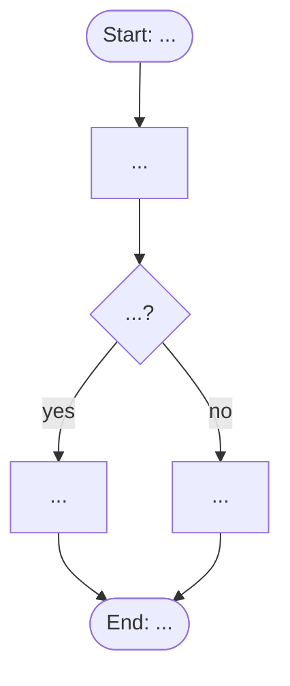

<!--
  This is the living, markdown form of the Techjays Design & Discovery SCOPE DOCUMENT.
  It follows the structure and conventions of the Techjays D&D Scope Document Template,
  evolved (contract v1.x) to make USE CASES first-class: every module carries a master
  flow and a nested Use Cases layer, so each distinct scenario/route is documented with
  its own explanation, workflow, flow diagram, and worked example.
    docs/D&D Documentation/02 - Scope Document Template.docx  (base template)
  The Doc Agent renders this markdown into the branded .docx at scope-freeze time, and
  renders each Mermaid flow into a branded SVG swimlane (see delivery-os-conventions §8).

  Conventions (keep, but author-guidance lines marked ✎ are deleted before issuing):
    ✎ grey-italic note          → author guidance, delete before issuing
    ▸ Ask the client            → an open question to resolve with the client (also logged as a CLR / RAID Q-##)
    [bracketed text]            → placeholder to replace
    Resp. = AI | DET | HUM      → AI capability / deterministic logic / human action
    Pri.  = M | S | C | W        → MoSCoW: Must / Should / Could / Won't-this-phase
    Requirement IDs             → <MODULE>-<FR|AI|DET|HUM>-<NN>  e.g. INTK-AI-02
    Use-case IDs                → <MODULE>-UC-<NN>               e.g. INVP-UC-01
    Mermaid flows               → ```mermaid fenced blocks; living source for the branded SVG
-->

# Scope Document

**Project:** [Project / Engagement Name]
**Client:** [Client Legal Name]
**Version:** [0.1 — Draft]
**Date:** [DD Mon YYYY]
**Status:** [Draft / In Review / Approved]

---

## 1. Scope Statement

> ✎ One or two clear sentences defining the boundary of what is being delivered.
> ▸ Ask the client: What outcome must be true at go-live for this to be a success?

[e.g. "An AI-assisted request-processing system that ingests, extracts, validates, and posts [X] requests to [system of record], with human approval on exceptions, replacing the current manual workflow."]

---

## 2. Module Breakdown

> ✎ Decompose the business into modules. Each module gets its own detailed section in §3 and its own sign-off. Keep names consistent across the whole pack. Typical set: Intake, Processing, Validation, Approval, System Updates, Exception Handling, Reporting, Admin, Integrations.

| Module | One-line purpose | Specified in §3? |
|--------|------------------|------------------|
| [Intake] | [Receive and log incoming requests] | [Y] |
| [Processing] | [AI extraction / classification] | [Y] |
| [Validation] | [business-rule & duplicate checks] | [Y] |
| [Approval] | [human review & routing] | [Y] |
| [System Updates] | [post to ERP / CRM] | [Y] |

---

## 3. Module Requirements

> ✎ One sub-section per module. Copy the block below per module. Keep every sub-heading even when the answer is "None" — an explicit "None" records a decision; a missing one is a gap. Capability-level requirements only; detailed testable specs are deferred to the SRS.
> ✎ Each module carries a **Master Flow** (§3.x.3) and a **Use Cases** layer (§3.x.4). The master flow shows the whole journey and its branch points; each distinct scenario/route below it is written up as its own use case with an explanation, a workflow, a flow diagram, and a worked example. A branch becomes its own use case only when it differs *materially* (different steps, actors, business rules, systems, or outcome) — a difference of data value alone is a business rule or an alternative flow, not a use case. See `ba-extraction` for the decision rule.

### 3.x Module: [Module Name]

#### 3.x.1 Current → Future State
- **Current:** [actors, triggers, systems, manual steps, where delays/errors occur]. `[SRC-### › path]`
- **Future:** [what AI does, what software does deterministically, where humans approve].

#### 3.x.2 In Scope / Out of Scope
- **In scope:** [capabilities, document/data types, workflows, integrations included].
- **Out of scope:** [excluded, deferred, or unconfirmed items].
> ▸ Ask the client: Is there anything you assume is included that we have not listed here?

#### 3.x.3 Module Master Flow
> ✎ The end-to-end journey for this module in one picture: the trigger, the happy path, and the **decision/branch points** where the route diverges. Each branch names the use case (§3.x.4) it leads to, so the master flow and the use cases stay 1:1. Keep it to the skeleton — step-level detail lives inside each use case.

[One or two sentences describing the overall journey and what makes it branch.]

```mermaid
flowchart TD
    A([Trigger: incoming item]) --> B{Which [type / condition]?}
    B -->|[condition A]| UCA[MOD-UC-01: name]
    B -->|[condition B]| UCB[MOD-UC-02: name]
    B -->|[condition C]| UCC[MOD-UC-03: name]
    UCA --> Z([Posted to system of record])
    UCB --> Z
    UCC --> Z
```

#### 3.x.4 Use Cases
> ✎ One `##### ` block per distinct scenario/route. Keep every labelled field — write "None identified yet" rather than deleting one. Route-specific edge cases live *inside* the use case; cross-cutting module exceptions stay in §3.x.10. Each use case is mirrored in `use-case-register.md` under the same `MOD-UC-##` id.

##### 3.x.4.a [MOD-UC-01] — [Use Case Name]
- **Actor / Persona:** [who initiates / owns this route]
- **Trigger:** [what starts it]
- **Preconditions:** [what must already be true]
- **When this route applies:** [the condition that selects this route over its siblings — the crux for branch cases, e.g. "invoice type = Credit Memo"]
- **Explanation:** [what happens on this route and *why* it is a distinct case]
- **Workflow:**
  1. [step] `[SRC-### › path]`
  2. [step]
  3. [step]
- **Flow diagram:**



- **Worked example:** [a concrete, realistic instance with actual-looking data that shows this route running end to end] `[EX-### ]`
- **Business rules:** [rules that govern this route] `[BR-### ]`
- **Edge cases & exceptions:**

| Edge case | Handling |
|-----------|----------|
| [route-specific exception] | [handling] |

- **Acceptance criteria:** [what must be true for this route to be accepted]
- **Source references:** `[SRC-### › path]` · requirements [MOD-FR-##] · workflow [WF-###]

##### 3.x.4.b [MOD-UC-02] — [Use Case Name]
> ✎ Repeat the block above for every distinct route. Keep the ids sequential within the module.

#### 3.x.5 Functional Requirements
> ✎ Capability-level requirements for the module. The **Use Cases** column ties each requirement to the route(s) it serves; the same id is used in `requirement-register.md`.

| ID | Requirement | Use Cases | Resp. | Pri. | Acceptance criteria |
|----|-------------|-----------|-------|------|---------------------|
| [MOD-FR-01] | [requirement] | [MOD-UC-01] | [DET] | [M] | [criterion] |
| [MOD-AI-02] | [requirement] | [MOD-UC-01, MOD-UC-02] | [AI] | [M] | [≥95% field accuracy on the agreed test set; below threshold → triage] |

#### 3.x.6 AI / Automation Responsibilities
- **AI does:** [scope of the model's job here]
- **Confidence threshold & fallback:** [value + what happens below it, e.g. 0.85 → route to triage]
- **Human-in-the-loop:** [where a person reviews/approves]

#### 3.x.7 Business Rules
> ✎ Module-level / cross-cutting rules. A rule that governs only one route lives in that use case (§3.x.4).
- [approval / matching / validation / escalation rules] `[BR-### › source]`

#### 3.x.8 Data Fields

| Field | Type | Req. | Source / validation |
|-------|------|------|---------------------|
| [field] | [type] | [Y/N] | [source / validation] |

#### 3.x.9 Integrations
- [system + API / protocol + direction (read/write)] `[INT-### ]`

#### 3.x.10 Exception Handling
> ✎ Cross-cutting exceptions that apply across the module's routes. Route-specific edge cases live inside their use case (§3.x.4).

| Exception | Handling |
|-----------|----------|
| [Missing mandatory field] | [block auto-routing; flag for triage] |
| [Duplicate] | [link to existing item; notify] |
| [API / system failure] | [retry N× with backoff; alert on final failure] |
| [Low AI confidence] | [route to human / hold] |

#### 3.x.11 Acceptance Criteria
- [What must be true for this module to be accepted — tie to the use cases (§3.x.4) and requirement IDs above.]

---

## 4. AI vs. Deterministic Responsibility Split

> ✎ State the dividing line for the whole engagement: what AI may decide, what stays deterministic, where a human must confirm. This governs every module.
> ▸ Ask the client: Where are you comfortable letting AI act automatically, and where must a person sign off?

[e.g. AI extracts and classifies; deterministic logic enforces business rules and posts to systems of record; humans approve anything below the confidence threshold or above a value threshold.]

---

## 5. User Roles & Permissions

| Role | Description | Key permissions |
|------|-------------|-----------------|
| [End user] | [submits / processes] | [create, view] |
| [Approver] | [reviews AI output] | [approve, reject, edit] |
| [Admin] | [configures rules / users] | [full config] |

---

## 6. Global Out-of-Scope

> ✎ Cross-cutting exclusions that apply beyond a single module. Being explicit here prevents silent assumptions later.

- [e.g. data migration of historical records]
- [e.g. mobile-native apps]
- [e.g. integrations not listed in §3]

---

## 7. Assumptions & Dependencies

> ✎ Assumptions and dependencies are owned in the **RAID Register** — reference it here rather than duplicating, so there is one source of truth. The BA `assumption-register.md` and `clarification-log.md` feed the RAID Register (Assumptions `A-##`, Dependencies `D-##`, Open Questions `Q-##`).

See the RAID Register for the full, living list of assumptions, dependencies, risks, and open questions that this scope depends on.

---

## 8. Approval & Scope Freeze

> ✎ This section freezes the scope above as the baseline for fixed-bid estimation. Filled at scope-freeze time (status → Frozen). The BA agent drafts it; humans complete sign-off.

### 8.1 Exclusions Acknowledgement
The client acknowledges the items listed as out-of-scope (§3 per module and §6 global) and any T&M-recommended or future-phase items, so nothing is assumed included by silence.

### 8.2 Change-Control Note
Any new requirement, workflow, integration, report, business rule, exception scenario, data variation, third-party limitation, or change to an approved assumption identified after this approval may affect cost, timeline, and approach, and will be handled through change control rather than absorbed into the existing baseline.

### 8.3 Client Sign-off
The client confirms the scope, module behaviours, business rules, integration dependencies, exception handling, exclusions, and acceptance criteria above are accurate and approved as the baseline for [Project Name].

| Name | Role | Organisation | Signature / Date |
|------|------|--------------|------------------|
| [Name] | [Sponsor / Product] | [Client] | |
| [Name] | [Technical lead] | [Client] | |
| [Name] | Engagement lead | Techjays | |
