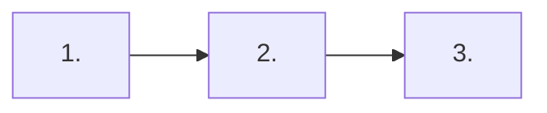
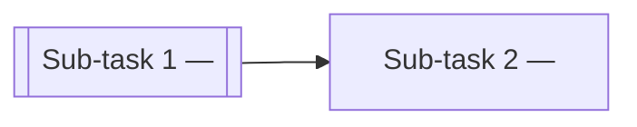

# `tl-feature-compose` — output templates (three modes)

This file gives the SHAPE for each compose mode. It carries placeholders, not content — the compose fills the content from the analysis scratchpad, the TL code-context graph, and the parent BA files at run time. Rules that govern shape and quality live in `SKILL.md` (Rules 1–15 + 11.3–11.15); this file references them by number rather than duplicating.

Jump to:
- **§implementation** — 8-section spec (§1–§8) for parent-alone or per-sub-task Implementation
- **§description** — sub-task Description tab (6-section user-story format)
- **§rollup** — parent Implementation tab when the feature was split (3 sections)

---

## §implementation — 9-section Implementation tab (v2.3.11, discipline sharpened v2.3.14)

Used for a parent Task's Implementation tab (parent-alone) OR a sub-task's Implementation tab (per-sub-task, scoped to that repo's units). Nine sections, plan-only, stack-agnostic vocabulary.

### The mental model — read this before writing any section

implementation.md is a **build script for a developer or coding agent**. It contains only what the developer TYPES INTO A FILE — file paths, component names, prop/state/field names + types, request/response shapes, refusal codes + messages, control behaviour, endpoint contracts, index declarations, order-of-checks steps, rollback commands. Everything else — business goals, why an AC exists, why a BR is enforced, why a design decision was made, what an assumption implies — lives on OTHER tabs (Description / Business Rules / Acceptance Criteria / NFRs / Test Scenarios / Dependencies) or in the local TL context units (endpoint/entity/page files).

**The one-question test before every line:** *"Is this something the developer types into a file, or something they read to understand?"*
- **TYPES INTO A FILE** → keep. Directive. Enters the code.
- **READS TO UNDERSTAND** → cut. Rationale. Lives elsewhere.

Rule 3 in SKILL.md is the enforcement contract. Rule 10b's pre-write scan halts on: sentences starting with `This ensures/means/handles/prevents/guarantees/allows`, `AC-\d+`/`BR-\d+`/`TS-\d+` mentioned outside §1 Satisfies column and §7 mitigation cells, `handled per §X`-style narrative cross-refs, restated table content after a table, restated parent assumptions in §7, any `## 7. Coverage` heading (v2.3.16 — no coverage table in the plan), any `Deferred` status text (v2.3.16 — no deferrals in feature plans).

**If you're tempted to write "This is because…" or "This ensures…", the sentence that follows is the FACT — write only that fact, as a directive, in the smallest possible table cell or bullet.**

### Frontmatter

**Parent-alone (`features/<slug>/implementation.md`):**
```yaml
---
doc_type: implementation
schema_version: 2.0
produced_by: tl
feature_id: FEAT-<AREA>-NN
capabilities: [<role>, <role>...]   # controlled vocab per Rule 11.15
compose_mode: implementation
composed_at: <ISO date>
inputs_hash: <sha256 of feature.md + owned unit bodies>
---
```

**Per sub-task (`features/<slug>/subtask/<repo>/implementation.md`):**
```yaml
---
doc_type: implementation
schema_version: 2.0
produced_by: dev
feature_id: FEAT-<AREA>-NN
parent_task_object_id: <MC _id>
parent_task_number: Feature-N
subtask_number: 1..N
subtask_repo: <repo-slug>
capabilities: [<role>, <role>...]   # controlled vocab per Rule 11.15
jetrix_subtask_object_id: <MC _id, empty until push>
jetrix_subtask_number: Subtask-N
compose_mode: implementation
composed_at: <ISO date>
inputs_hash: <sha256 of feature.md + THIS sub-task's owned unit bodies>
---
```

Feature identity lives in frontmatter (and MC task metadata). Never in the visible content — no `# FEAT-…` heading, no id inline (Rule 4).

### Section skeleton

```markdown
## 1. Build sequence

<one paragraph naming the phases + their dependency order. Marks any [HELD · waiting on OQ-<id>] phase explicitly.>

### Step 1 — <short step title>

- **Files** — New: `<path>` · Modified: `<path>`
- **Units** — `<unit IDs, comma separated>`
- **Satisfies** — `<parent AC/BR/TS IDs>`  <!-- canonical plan-time coverage owner per Rule 11.11 v2.3.16 -->

<one-line directive of what the developer writes in these files. No rationale.>

### Step 2 — <short step title>

- **Files** — …
- **Units** — …
- **Satisfies** — …

<one-line directive.>

<!-- Continue § Step 3, Step 4, … one section per step. If a step is HELD, add
     a line "**Status:** [HELD · waiting on OQ-<id>]" immediately under the H3
     and skip the Files/Units/Satisfies bullets. -->



Node labels MUST be quoted (`["1. <phase>"]`, not `[1. <phase>]`) — unquoted labels are parsed as ordered-list markdown, which breaks rendering.

**Why per-step sections instead of a pipe table (v2.3.26):** GFM pipe tables fail in many external MD viewers when a step's `Satisfies` cell carries multiple long IDs — the row wraps, the separator row can be misread as a setext H2 underline, and the header shows larger than the section heading above it. Per-step H3 blocks render correctly in every viewer AND survive the Rule 0c.i mechanical fix pass without ambiguity. The `Files`/`Units`/`Satisfies` bullets carry the same data the old columns did — no plan content is lost.

## 2. Impacted components

12-dimension impact matrix, stack-agnostic dimension names. Every row is either a real impact statement or `N/A — <specific reason>` (Rule 11.12; bare `N/A` halts).

| Dimension | Impact |
|---|---|
| Surfaces | <impact statement or `N/A — <specific reason>`> |
| Operations | … |
| Stored data | … |
| Authz | … |
| Integrations | … |
| Background jobs | … |
| Notifications | … |
| Observability | … |
| Existing tests | … |
| Docs | … |
| Flags | … |
| Analytics | … |

Per-repo additional dimensions get added by the compose based on shape (e.g. `Screens` for UI-heavy repos, `Migration` for stateful repos, `Accessibility` for interactive repos, `Message contract` for queue repos).

## 3. Operations exposed and consumed

One heading per operation this sub-task owns, modifies, or consumes. Stack-agnostic — covers REST endpoints, GraphQL resolvers, gRPC methods, queue message handlers, background job triggers, CLI commands. Consumer sub-tasks pull owner's contract verbatim per Rule 11.6.

<For an owned operation:>

### <method + path or operation name> — <role, plain-language> (<unit ID>)

<one line naming auth boundary, mounted middlewares/guards>

**Inputs**

| Name | Location | Type | Required | Constraint |
|---|---|---|---|---|
| <name> | <path/query/body/header/message-field> | <type> | <yes/no> | <constraint> |

```<payload-format>
{ <example payload> }
```

**Order of checks**

| # | Check | Failure |
|---|---|---|
| 1 | <check> | <code> |
| 2 | … | … |

**Success — `<code>`**

```<payload-format>
{ <example success payload> }
```

**Refusals** — one row per distinct message.

| Code | Condition | message |
|---|---|---|
| <code> | <condition> | "<exact message text>" |

**Invariants.** <idempotency / partial-write behaviour / side effects / concurrency / ordering guarantees>

<For a consumed operation (Rule 11.6):>

### <method + path or operation name> (<unit ID>, consumed here — owned by sub-task N)

Contracts below are copied byte-for-byte from sub-task N; nothing here is redefined.

<Inputs table, payload examples, order-of-checks summary, refusals table — all lifted from owner. Add a "Called by / When" line naming which surface/component in THIS sub-task triggers each call.>

## 4. Stored data changes

Every persisted-state change this sub-task makes. Stack-agnostic — covers SQL tables, NoSQL collections, KV keys, object-store paths, cache regions, file-store paths. If the sub-task has no persistence (its capabilities don't include `owns-state`/`reads-state`), one line: `None.`.

**Store:** <name and unit ID>, <new / modified>.

| Field | Type | Source of value |
|---|---|---|
| <field> | <type> | <where the value comes from — request body, session, server clock, computed> |

**Never touched:** <one-line list of fields the sub-task does not write, so reviewers see the boundary>.

**Index:** <index declaration in prose — e.g. `{ task_id: 1, created_at: -1 }` — serves which query>.

**Declaration hazards:** <repo-specific gotchas in prose — e.g. "use `required: true`, not `require:` (silently ignored)">.

**Migration:** <required per Rule 11.10a for altered stores with live rows — ordered forward steps, backfill strategy, dual-read window, rollback that isn't `drop`, consistency window. OR `None — new store, no live rows.`>

## 5. User-facing surfaces

Every UI/interaction surface this sub-task adds or modifies. Stack-agnostic — web pages, mobile screens, CLI commands, terminal UIs, service dashboards. If the sub-task has no user-facing surface (backend-only, job-only), one line: `None. Delivered by <sibling>.`.

### Where it lives

<one-line entry point — route path or CLI command or screen navigation source; what file/module it mounts on; whether it's a landing page or a section-in-page>

<optional ASCII tree of component hierarchy>

**Operation wiring** — which surface calls what.

| Surface | Trigger | Calls |
|---|---|---|
| <surface role> | <user action> | <operation from §3 OR "opens the <dialog role>"> |

<Per user-facing surface heading:>

### <surface role>

| Prop | Type | Produced by |
|---|---|---|
| <prop name> | <type> | <source — route match, parent state, session read, …> |

| State | Type | Purpose |
|---|---|---|
| <state name> | <type> | <purpose in one line> |

**Effects.** <lifecycle triggers, refetch semantics>

**Rendered states.** <loading / empty / populated / refusal variants — how each renders>

<Per control:>

| Control | Behaviour |
|---|---|
| <control name> | <shape + validation + enablement + on-submit behaviour> |

**On success** — <what the surface does + what the surrounding context does>.

**On refusal** — <inline / toast / banner + placement per code>.

| Code | Placement | Additional action |
|---|---|---|
| <code> | <where the message renders> | <optional follow-up, e.g. "refresh the list"> |

<Repeat for each surface (e.g. dialog, row, list, confirm modal, form, screen).>

### Service / adapter layer — <path>

One paragraph describing the layer that talks to §3's operations from this surface. Names the wrapper for each call, what unwrapping happens here vs at the component, how the layer branches success vs refusal (per §8 Shared contract), and how a global session-expiry response is handled once at this layer rather than per call.

<Repo-specific hazards a consumer needs — e.g. "these are the first three call sites to use the fourth argument of `commonReq.js`; sibling call sites read `result.data.message` at the top level which does not exist on a rejection">.

## 6. Touch points

Existing components reused + new components added + cross-sub-task deliveries/consumptions.

|   | Component / role | Path |
|---|---|---|
| Reuse | <role — one line naming why it's the right host> | <existing file path> |
| Reuse | … | … |
| New | <new component / module / unit> | <new file path> |
| Cross-sub-task | Delivers <unit IDs> to sub-task N (<repo>) | — |
| Cross-sub-task | Consumes <unit IDs> from sub-task N (<repo>) | — |

**Reviewer note:** Reuse rows should be re-verified against the current context graph — the composer's snapshot could be a run old.

<!-- v2.3.16 — NO §7 Coverage table. Plan-time coverage lives in §1 Satisfies column + qa/quality-gates.md tier pool. Build-time evidence lives in dev/acceptance-map.md. No "Deferred to E2E" concept — E2E is a covered tier owned by whichever sub-task authors the E2E test file (declared in that sub-task's §1 Files column, cross-referenced in other sub-tasks' §6 Touch points). §7 Risks and rollback follows next; former §8 Shared contract is now §8. -->

## 7. Risks and rollback

**Risks table.**

| ID | Risk | Severity | Mitigation |
|---|---|---|---|
| R-1 | <risk description> | High / Medium / Low | Covered by <AC-N + BR-M> at <tier list from qa/quality-gates.md> |

<!-- v2.3.15 — NO "Assumptions" heading. Boring decisions (no pagination / no rate limit / no permission model / no optimistic updates / no polling) live IN CONTEXT at their code-implementation site per Rule 11.13 §5: §3 per-operation Invariants line ("Not paginated — full result set returned") or Authz line ("Any authenticated caller; no role check"), §5 per-surface Effects line ("No polling; refetch on hostId change + explicit refetch()") or on-success line ("Refetch before mutating local state"). §7 carries Risks + Out of scope + Rollback ONLY. -->

**Out of scope for this sub-task.** <max 3 bullets — each names a specific implementation NOT delivered by this sub-task, one line: `No edit operation — no PUT/PATCH route registered; UI shows no edit affordance`. Never restate parent's out-of-scope.>

**Rollback — cheapest lever:** <one-line action that removes user-visible reach with the smallest edit. Names the §1 step it undoes.>

**Rollback — full:** <bullet list of every file/artefact to delete or revert + any store-level rollback (drop new store, undo migration). Every §1 step either reverted here or explicitly justified as harmless-if-left>.

## 8. Shared contract

Wire-level cross-sub-task invariants, inherited byte-for-byte across every sub-task in the split (Rule 11.3). Wire and abstract-condition only — no framework field paths (Rule 11.3a).

| | |
|---|---|
| How the caller is identified | <the credential on the wire + where the caller reads it from + the abstract identity exposed to receiving code> |
| Shape of one record | <bare object / wrapped / envelope shape, id encoding, null handling> |
| Shape of a list (or collection) | <array-under-key / bare array / envelope, empty representation, whether pagination fields ride here> |
| How a caller knows an operation failed | <the abstract condition — success shape ≠ refusal shape / status field / discriminated union tag> |
| Where the code and message are read from a refusal | <abstract path in prose — e.g. "status is at the top level of the refusal object; the human-readable message is nested one level below"> |
| Global session-expiry behaviour | <one canonical answer applied everywhere at the interface layer> |
| Common identifiers | <format — opaque string / UUID / ULID / integer / composite — length and case rules if relevant> |
| Time and locale | <wire time format, timezone assumption, locale for user-visible text> |
| Pagination convention (feature-wide) | <cursor-with-named-field / offset+limit / page+size, OR "no pagination in v1 — accepted"> |
```

### Rules and constraints

Rules 1–15 in `SKILL.md` govern the shape. Highlights that apply to this template:

- Rule 1 — file paths ARE required in §1/§4/§5/§6, forbidden in §8 Shared contract.
- Rule 2 — framework/library names may appear as facts (`Jest + Testing Library green at plan time`) or hazards (`use required: true, not require:`); no version numbers next to them; no framework-idiomatic code blocks.
- Rule 3 — IMPLEMENTATION DIRECTIVES ONLY. No duplication of other tabs. No rationale/theory prose. Apply the one-question test to every line: *"Is this something the developer TYPES INTO A FILE, or something they READ TO UNDERSTAND?"* Only "types into a file" content stays. Banned prose patterns (compose halts): BR/AC restatements, sentences starting with `This ensures/means/handles/prevents/guarantees/allows`, inline AC-N/BR-N/TS-N references outside §7, "handled per §X" narrative connectors, test-assertion reasoning in §7 Evidence column, restated parent assumptions in §8. See SKILL.md Rule 3 for the full per-section banned-content catalog.
- Rule 4 — no feature identity in visible content.
- Rule 5 — "Never touched" line is the whole allowance for existing fields the feature does not write.
- Rule 6 — one row per distinct refusal `message`.
- Rule 7 — no client-narrative or provenance callouts.
- Rule 8 — no aspirational text; either the decision is stated or the phase is `[HELD · waiting on OQ-<id>]`.
- Rule 9 — no secrets; env var names only.
- Rule 10 — HARD per-section budget (v2.3.13, tightened + density-mandated; v2.3.16 dropped §7 Coverage). Total soft target ~13 400 chars; warn at 40 000 chars; refuse at 60 000 chars. Measure in CHARACTERS (`len(text)`), not bytes. DENSE not verbose — every sentence carries a distinct concern from Rule 10a's required-coverage checklist; paragraph-where-a-line-would-do halts the compose (Rule 10b). Tables and bold-prefix bullets win over prose everywhere except §5's service-layer paragraph (max 6 lines).
- Rule 10a — Required-coverage checklist per section. Every listed concern is covered in ONE dense line or ONE table row. Missing concern → halt; over-length concern → halt. See SKILL.md Rule 10a for the full per-section checklist (§1/§2/§3/§4/§5/§6/§7/§8/§9). Frontend §5 in particular must name every concern (props, state, effects, rendered states, controls, on-success, on-refusal, refusal-placement, accessibility, local-vs-server checks, session-expiry, service-layer contract) — always in ONE line each, never in a paragraph each.
- Rule 11 — no invention; every claim traces to the analysis scratchpad, TL context graph, or parent BA files.
- Rules 11.3, 11.3a — §8 shape and no-framework-field-paths guarantee.
- Rule 11.4 — implementation.md is PLAN not CODE; describe shape in prose/tables, don't paste implementations.
- Rule 11.5 — MECHANICAL markdown scan pre-write (tables one-row-per-line, mermaid fenced, headings level-2, code fences balanced, bullet `-` consistent, blank line before/after every table/fence/heading).
- Rule 11.6 — consumer sub-task's §3 includes consumed contracts in full.
- Rule 11.7 — every sub-task's §3–§6 reaches the same structural completeness bar.
- Rule 11.8 — cross-sub-task interconnection verified at compose time; identical wire shape across every sub-task that references it.
- Rule 11.9 — pre-write self-consistency validation (10 checks).
- Rule 11.10 — feature-shape adapters (migration, message contract, authz decision, expected query plans, dependency graph, monitoring observation contract).
- Rule 11.11 (v2.3.16) — Plan-time coverage owner is §1 Satisfies column; build-time evidence in `dev/acceptance-map.md`; NO §7 Coverage table; NO "Deferred" concept.
- **Rule 0 (v2.3.17) — ONE compose, ONE lint, ONE optional auto-fix. NEVER a halt-and-rewrite loop.** 10 mechanical triggers halt (payload > 60 000 chars, `## 7. Coverage` heading, `Deferred` status, `**Assumptions.**` heading, pipe-row-on-one-line, unclosed code fence, framework field path in §8, `# FEAT-` heading, mermaid fence missing `mermaid` language tag, missing blank line before/after tables/fences/mermaid/headings). Most auto-fix in-place (string transforms — remove heading, insert newline, insert `mermaid` tag). Everything else — Rules 10a/10b/11.5/11.9/11.10/11.12/11.13 — becomes a WARN reported in a `## Compose lint findings` block. The user decides whether to fix and re-run, or accept.
- **Rule 0d (v2.3.17) — MC rendering contract for `react-markdown v9 + remark-gfm v4 + mermaid v11`.** Tables: every row on its own physical line, header separator (`|---|---|`) on its own line, blank line before/after. Mermaid: fenced with exactly `\`\`\`mermaid`, node labels with numbers/spaces MUST be quoted (`S1["1. Step"]`). Code fences: balanced. Headings: `##` for numbered sections, `###` for sub-sections, never `#`. Blank lines before/after every table/fence/mermaid/heading — remark-gfm silently DROPS blocks without blank-line surrounds.
- Rule 11.12 — every §2 row substantive; bare N/A halts.
- Rule 11.13 — content-quality principles (exhaustiveness, refusal consumers, named dependencies, branching stated, boring decisions recorded, noun cross-check, adversarial read).
- Rule 11.14 — two-tier rollback in §7.
- Rule 11.15 — `capabilities:` frontmatter controls cross-sub-task check.

### Size budget (v2.3.13 — DENSE not verbose)

**Measure in CHARACTERS (`len(text)`), not bytes.** MC caps `implementationDetails` at 60 000 CHARACTERS. Em-dashes count as ONE character each.

**Density mandate — every sentence carries ONE distinct concern from Rule 10a's checklist.** No two sentences say the same thing at different volume. Tables and bold-prefix bullets win over prose everywhere except §5's service-layer paragraph (max 6 lines). Paragraph-where-a-line-would-do halts the compose (Rule 10b).

**Per-section maximums** (v2.3.13 — tightened; see SKILL.md Rule 10 for full table + Rule 10a for required-coverage checklist + Rule 10b for density enforcement):

| Section | Target | Max | Format |
|---|---|---|---|
| §1 Build sequence | 1 400 | 2 200 | Intro 3 lines + step table + mermaid |
| §2 Impacted components | 1 000 | 1 800 | ONE row per dimension, no sub-bullets |
| §3 Operations exposed and consumed | 4 500 | 9 000 | Tables + payloads only, no restating paragraphs |
| §4 Stored data changes | 900 | 1 800 | One table + one-line each for touched/index/hazard/migration |
| §5 User-facing surfaces | 3 500 | 6 000 | Per surface: tables + one-line-each for effects/states/on-success/on-refusal/accessibility/session-expiry; service-layer para max 6 lines |
| §6 Touch points | 700 | 1 200 | Table only |
| §7 Risks and rollback | 700 | 1 400 | Risks table max 5 + Out of scope max 3 + two-tier rollback. NO Assumptions heading. Mitigations reference AC/BR/TS + tier. |
| §8 Shared contract | 700 | 1 200 | Fixed 8–9 row table per Rule 11.3 |
| **Total (soft target)** | **~13 400** | **~24 400** | Leaves ~35 KB headroom for Rule 11.10 adapter blocks |

**Warn line: 40 000 chars. Refuse line: 60 000 chars.** On first-write exceed, HALT before writing — never compose freely then trim. Apply the section's drop rule OR split the sub-task (a §3 that won't fit is a sub-task owning too many operations; a §5 that won't fit is multiple surfaces mounted together). If the sub-task genuinely won't fit within budget after applying the drop rules, that's a sub-task scope issue — split, don't shave.

**Required-coverage checklist per section (SKILL.md Rule 10a):** every listed concern MUST appear in ONE dense line (or ONE table row) — missing coverage halts; over-length coverage halts. The checklist is a floor on COVERAGE, never a floor on word count. §5 in particular (the section that tends toward verbose) must cover: props / state / effects / rendered states / controls / on-success / on-refusal / refusal-placement / accessibility / local-vs-server checks / session-expiry / service-layer contract — each in ONE line.

---

## §description — sub-task Description tab (v2.3.5, 6-section user-story format)

Used for a sub-task's Description tab. User-story voice — voiced from the USER's perspective, not the system's. Six deterministic sections.

### Frontmatter

```yaml
---
doc_type: description
schema_version: 2.0
produced_by: dev
feature_id: FEAT-<AREA>-NN
parent_task_object_id: <MC _id>
parent_task_number: Feature-N
subtask_number: 1..N
subtask_repo: <repo-slug>
jetrix_subtask_object_id: <MC _id, empty until push>
jetrix_subtask_number: Subtask-N
compose_mode: description
composed_at: <ISO date>
inputs_hash: <sha256 of the compose inputs>
---
```

### Body shape

```markdown
## User story

**As a** <role from parent's users: frontmatter or workflow.md actors>,
**I want to** <what the user WANTS to do — action from user's POV, not "the system does X">,
**So that** <business outcome the user gets>.

<2–3 sentences of business context establishing WHY this matters to the user — the pain point being solved, the current workaround being replaced.>

## User scenarios

- **<Action name>** — <what the user does, sees, and gets, in present-tense active voice from the user's POV. 1–2 sentences.>
- **<Action name>** — <same>.
- **<Action name>** — <same>.

## Business rules that apply

- **BR-<n>** — <one-line paraphrase of the parent BR that THIS sub-task's flows enforce>.
- **BR-<n>** — <same>.

## What users see when refused

- **<Business situation>** — <what the user READS or PERCEIVES, framed as the user's experience — not the API response code or the field name>.
- **<Business situation>** — <same>.

## Out of scope for this user story

- <What the user CAN'T do here + where they'd go for it, from the user's perspective, including cross-sub-task boundary if the feature was split>.
- <same>.

## Related user stories

- **Sub-task N (<repo>)** delivers the user story for <how the user experiences the counterpart slice>.
```

Format constraints (Rule 13):
- Headings `##` (level 2) only.
- Bullets `-` prefix.
- Bold role names first two words of each bullet.
- NO HTTP status codes (`400`, `409`, `201`), NO field names (`added_by`), NO file paths, NO framework names, NO method names (POST/GET/DELETE), NO tables, NO code fences, NO mermaid.
- Business vocabulary from parent's feature.md + workflow.md — never technical translations.

### Per-section character budget (HARD budget planned upfront, not trimmed after)

| Section | Target (chars) | Max (chars) |
|---|---|---|
| User story | 350 | 500 |
| User scenarios | 500 | 700 |
| Business rules that apply | 250 | 400 |
| What users see when refused | 250 | 400 |
| Out of scope for this user story | 150 | 250 |
| Related user stories | 80 | 150 |
| **Total (soft target)** | **~1580** | **~2400** |

Absolute refuse line: 3 KB. If the first-pass compose exceeds 2 KB, one of the drop rules in `SKILL.md` was violated — rewrite the offending section within its budget, don't shave prose after.

---

## §rollup — parent Implementation tab when the feature was split

Used for the parent Task's Implementation tab when `/dev:plan` split the feature into sub-tasks. Replaces the detailed `implementation`-mode spec at the parent level; the detail lives on each sub-task's Implementation tab.

### Frontmatter

```yaml
---
doc_type: tl-plan
schema_version: 1.2
produced_by: tl
feature_id: FEAT-<AREA>-NN
compose_mode: rollup
composed_at: <ISO date>
inputs_hash: <sha256 of each sub-task's description.md + implementation.md bodies + parent feature.md>
---
```

### Section skeleton

```markdown
## Build sequence

<one paragraph naming each sub-task by role (backend, frontend, mobile, worker, service) and the dependency order at the sub-task level. Marks any [HELD · waiting on OQ-<id>] sub-task explicitly.>



## Sub-tasks

| # | Repo | MC Task | Depends on | Blocks | State |
|---|---|---|---|---|---|
| 1 | <repo> | Subtask-<N> | — | 2 | PLANNED |
| 2 | <repo> | Subtask-<N+1> | 1 | — | PLANNED |

`#` = execution sequence (from each sub-task's `subtask_number` frontmatter). `MC Task` = each sub-task's `jetrix_subtask_number` (MC display number). `Depends on` / `Blocks` reference other rows by `#`, not by MC task number (execution order is stable; MC numbering is not). `State` = each sub-task's `current_state` from its `status.md`.

## Touch points

Aggregated Reuse / New table at the parent level. A component reused across multiple sub-tasks appears once with all consumers listed.

| Kind | Role | Consumed by | Path |
|---|---|---|---|
| Reuse | <existing component / entity / service by role> | <sub-task list> | <path> |
| New | <new component / module> | <sub-task list> | <path> |

**Reviewer note:** Reuse rows should be independently re-verified against the current context graph.
```

### Size budget

Target 2 000–5 000 chars. Warn at 20 000 chars. Measure in CHARACTERS, not bytes. If a rollup exceeds 20 000 chars, detail belonging on sub-tasks is being duplicated here — check for that before continuing.

### Voice and constraints

Rules 1–15 from `SKILL.md` apply. Additionally:

- Never inline endpoint contracts, schemas, or UI shapes. Those live per sub-task. The rollup names sub-tasks and their sequence; it does not restate them.
- Cross-repo references use `#`, not MC display numbers. The Sub-tasks table's `Depends on` cell says `1`, never `Subtask-<N>` (which is unstable across MC renumbering).
- Touch points aggregates by role, not per sub-task. A component reused across two sub-tasks appears in ONE row with both sub-tasks in `Consumed by`, not two rows.
