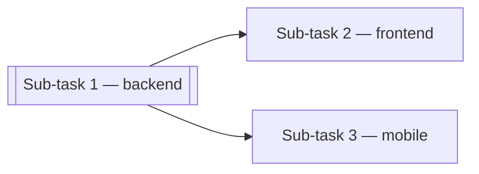

# `tl-feature-compose` — output templates (three modes)

This template covers the three compose modes: **detailed** (parent-alone or per-sub-task Implementation tab), **narrative** (sub-task Description tab), and **rollup** (parent Implementation tab when the feature was split into sub-tasks). The skill's SKILL.md picks the mode and points here for the shape; this file is the shape.

A reader of any composed file gets a document with no framework, library, version, or file-path noise. Components are named by their **role**.

Jump to:
- **§detailed** (below) — the 5-section spec for parent-alone or per-sub-task Implementation
- **§narrative** — the sub-task Description tab (one to two paragraphs of business prose)
- **§rollup** — the parent Implementation tab when sub-tasks exist (Sub-tasks table + touch points)

---

## §detailed — 5-section Implementation tab

Used for a parent Task's Implementation tab (parent-alone) or a sub-task's Implementation tab (per-sub-task, scoped to that repo's units).

Populates **only** the Implementation tab on the Jetrix Task via `/jetrix:push implementation`. Description, Business Rules, Acceptance Criteria, NFRs, Test Scenarios, and Dependencies of the parent are populated by BA push from other files — they never appear in this document. On a sub-task, the Description tab is populated in narrative mode (see §narrative); AC and TS tabs stay empty and validation reads parent.

### Frontmatter (required)

**Parent-alone (`features/<slug>/tl-plan.md`):**
```yaml
---
doc_type: tl-plan
schema_version: 1.2
produced_by: tl
feature_id: FEAT-<AREA>-NN
compose_mode: detailed
composed_at: <ISO date>
inputs_hash: <sha256 of feature.md + owned unit bodies>
---
```

**Per sub-task (`features/<slug>/subtask/<repo>/implementation.md`):**
```yaml
---
doc_type: subtask-implementation
schema_version: 1.0
produced_by: dev
feature_id: FEAT-<AREA>-NN
parent_task_object_id: <MC _id>
parent_task_number: Feature-N
subtask_number: 1..N
subtask_repo: <repo-slug>
jetrix_subtask_object_id: <MC _id, empty until push>
jetrix_subtask_number: Subtask-N
compose_mode: detailed
composed_at: <ISO date>
inputs_hash: <sha256 of feature.md + THIS sub-task's owned unit bodies>
---
```

Feature identity lives in frontmatter (and in the MC task metadata). It **never** appears in the visible content — no `# FEAT-…` or `# Subtask-…` heading, no reference to the id inline.

### Section skeleton

Five subsections, in this order. Cross-feature "must exist first" waits are captured in the **Dependencies tab** (BA-owned). Code-reuse targets are captured in **Touch points** below.

```markdown
## Build sequence

<one paragraph naming the phases and their dependency order. Each step's exit condition is captured inline in the API and Frontend sections that follow — this diagram is the sequence map, not the step spec.>

```mermaid
flowchart LR
    S1["1. <phase>"] --> S2["2. <phase>"]
    S2 --> S3["3. <phase>"]
    …
```

**Node labels MUST be quoted** — `["1. <phase>"]` not `[1. <phase>]`. Unquoted labels are parsed by mermaid as inline markdown; `1. ` starts an ordered list which mermaid can't render inside a node, so the label falls back to placeholder text ("Unsupported markdown: 1"). Quoted labels are treated as literal strings.

## API endpoints

### Create — <endpoint role, plain-language>

<one line naming HTTP method + path, auth requirement>

**Path parameter**  (only when the endpoint has one)

| Name | Type | Constraint |
|---|---|---|
| `<name>` | <type> | <role — e.g. "Identifier of the leave request"> |

**Request body**

| Field | Type | Required | Constraint |
|---|---|---|---|
| `<field>` | <type> | <Yes/No> | <constraint> |

```json
{
  "<field>": "<example value>",
  …
}
```

<one line naming what OTHER body fields are silently discarded, if any>

**Execution order — normative**

| Step | Check | Failure |
|---|---|---|
| 1 | <check> | <code + reason> |
| 2 | <check> | <code + reason> |
| … | … | … |

<one paragraph explaining any invariant the order guarantees — e.g. concurrency via a single conditional write>

**Success — `<code>`**

```json
{
  "<field>": "<example value>",
  …
}
```

<one line on what is returned and why the client uses it>

**Refusals** — every body is `{ "message": "..." }` and nothing else.

| Code | Condition | `message` |
|---|---|---|
| `<code>` | <condition> | `<exact message text>` |
| … | … | … |

<one paragraph naming the invariants: idempotency, partial-write behaviour, side-effects>

### Update — <endpoint role>  (if the feature updates one)

<same shape>

## Database modifications

<one line naming the affected data object by role — collection or table — and confirming what does or does not change: new fields, new indexes, migrations>

**Fields written by this feature:**

| Field | Type | Written value |
|---|---|---|
| `<field>` | <type> | <what is set, in prose> |

**Never touched** — <one line listing existing fields the feature does not write, so reviewers see the boundary>: `<field-a>`, `<field-b>`, `<field-c>`.

<one paragraph on any state semantics the write depends on — for example, "Pending is the only decidable state; Approved, Rejected and Cancelled are terminal">

## Frontend UI

**API wiring** — which surface calls what.

| Surface | Trigger | Calls |
|---|---|---|
| <surface role> | <user action> | <endpoint role + reference to the API section, OR "no call — opens the <dialog role>"> |
| <surface role> | <after a specific response> | <existing call — no new endpoint> OR <endpoint role> |

<one line naming what is the ONLY new call this feature adds and what everything else reuses>

### <surface role> — row / list / summary action

<one-line entry-point sentence naming where the parent page/surface is reached from and whether it's a landing page>

- <bullet on action visibility rule>
- <bullet on the read-only representation after action, if applicable>
- <bullet on graceful degradation>

### <dialog role>

Submits to <endpoint role>. Only <fields> are sent; identity or context is server-resolved.

| Control | Behaviour |
|---|---|
| <control name> | <shape + required + validation> |
| <control name> | <shape + required + validation> |
| Submit | Disabled until <condition>. Re-enables only on <condition> |
| Cancel | Closes without a request |

**On success** — <what the dialog does + what the surrounding surface does>.

**On refusal** — <keep dialog open? preserve values? render inline? banner?>

| Code | Placement | Additional action |
|---|---|---|
| `<code>` | <where the message renders> | <optional follow-up, e.g. "refresh the list behind the dialog"> |
| … | … | … |

<one line naming what the client mirrors from server validation for enablement, and confirming the server's `message` is always what is displayed>

### API service

One call wrapping <endpoint role>, returning a value the caller can distinguish across every response code above plus transport failure. The server's `message` is carried through unmodified.

## Touch points

> Reuse entries are verified against the target codebase at authoring time; re-verify if this ticket sits idle. New entries carry no path — naming and placement are the developer's call. Strip this sub-section if the ticket goes to a client.

| | Component |
|---|---|
| **Reuse** | <existing component described by role — one line naming why it is the right host> |
| **Reuse** | <existing component described by role> |
| **New** | <new component described by role> |
```

---

## What this file MUST NOT contain

Enforced by the composer. If any of these appear, the composition is wrong and must be redone.

### 1. File paths — anywhere

No `controllers/Leave.js`, `src/components/**/*.jsx`, `models/LeaveRequest.js`, `routes/router.js`, or any other path. Components are named by role: **the leave controller**, **the decision dialog**, **the API service layer**, **the leave list**, **the row action**. Reuse entries in the Touch points section name the existing component by role too, never by path.

### 2. Framework, library, or version names — anywhere

No `React`, `React 18`, `Vite`, `Express`, `Mongoose`, `TipTap`, `Redux`, `Playwright`, `Jest`, `axios`, `@uiw/react-md-editor`, `Prisma`, `SQLAlchemy`, or any version number. Describe what a component does, not what technology it uses. `new mongoose.Schema({...})` fences are forbidden — describe the data object by role and by the fields written.

### 3. Duplication of other tabs

Never re-print content that belongs in Description, Business Rules, Acceptance Criteria, NFRs, Test Scenarios, or Dependencies. **This document is Implementation-tab content only.**

- No Business Goal / feature summary / user-value section.
- No user-flow narrative (that lives in Description).
- No mermaid workflow diagram (that lives in Description).
- No AC list (that lives in Acceptance Criteria).
- No NFR list (that lives in NFRs).
- No Business Rule list (that lives in Business Rules).
- No Test Scenarios (they live in Test Scenarios).
- No Dependencies / Assumptions / Open Questions (they live in Dependencies).

The visible content of this document is: **Build sequence · API endpoints · Database modifications · Frontend UI · Touch points**. That is the entire allowance. Cross-feature dependencies live in the Dependencies tab (BA-owned); code-reuse targets live in Touch points.

### 4. Feature identity in visible headings or prose

Feature id, initiative, slug, provenance, and file-source annotations live in the frontmatter and the MC task metadata. Never in headings, never in prose. No `# FEAT-…` H1. No "Provenance: …" line. No mention of `feature.md`, `workflow.md`, `acceptance-criteria.md`, any `ba/…` file, any `context/…` file, or any scope-review filename. Ever.

### 5. Existing schema fields the feature does not write

If the feature modifies four fields on an existing model, print those four — and only those four — in the "Fields written by this feature" table. The other fields on the model are named in one line ("Never touched: `<field-a>`, `<field-b>`, `<field-c>`") for reviewer boundary awareness, and that is the whole allowance.

### 6. Redundant response text or duplicated status meanings

If the endpoint returns three distinct `409` messages, list three rows in the Refusals table. Never collapse "Approved" and "Rejected" into a single `409` row, and never leave the discrimination ambiguous. Similarly for `400` variants — list each `message` explicitly.

### 7. Client-narrative, provenance blocks, or author-side commentary

- No "the client chose transparency knowingly", "the plan is not consent", "note the tension worth raising with the client".
- No `⚠ PROVENANCE — PLANNED, NOT BUILD-READY` blockquote callouts.
- No "the register marks this …", "acceptance criteria are authored as bullets without ids".
- No "SIMULATED response round" preambles.

The task's Description and Dependencies tabs carry any workflow provenance the client needs to see.

### 8. Aspirational text

No "consider", "might", "could", "we should think about". A phase is either buildable or it is `[HELD · waiting on <OQ-id>]` and named as such.

---

## What this file MUST contain

- **Build sequence** — a paragraph naming the phases + their dependency order, plus a mermaid step-graph. The step table is NOT part of this section; each step's exit condition is captured inline in the API endpoints and Frontend UI sections that follow.
- **API endpoints** — one section per endpoint (Create / Update / Delete / Read), with Request body table, normative Execution-order table, Success JSON, and Refusals table. Every distinct response code and every distinct `message` gets its own row.
- **Database modifications** — the "Fields written" table for this feature, a one-line boundary listing "Never touched" fields on the same object, and a paragraph on any state semantics the write depends on.
- **Frontend UI** — an API-wiring table (which surface calls what), a section per user-facing surface (row action / dialog / etc.) describing behaviour by role, a Refusal-placement table, and a one-paragraph API service description.
- **Touch points** — a Reuse / New table naming existing and new components by role, with the internal review caveat.

## Size budget

- **Target:** 10–15 KB per feature (≈2500–4000 words).
- **Warn at:** 55 KB.
- **Hard fail at:** 60 KB — MC's `implementationDetails` field caps at 60 000 characters.

If a feature would compose above 60 KB, the feature is too wide — refuse to write, ask the user to split.

---

## Worked example

The full worked example lives at `<repo-root>/docs/dharma-feedback-plan-example.md` and demonstrates the exact shape, tone, and density this template requires. Read it once before composing your first feature. **Every rule above is honoured in that example** — no paths, no framework names, no cross-tab duplication, no feature id in visible content.

Two properties to lift from that example:

1. **Behaviourally detailed, repo-abstract** — execution order is normative and named as such; every response code carries its exact `message`; the dialog table names every control and its enablement rule. None of it names a file, a framework, or a version.
2. **Boundary-aware** — the "Never touched" line on the data object, the "only new call this feature adds" line in API wiring, and the Touch points table's "Reuse / New" split all give a reviewer the change boundary at a glance.

---

## §narrative — sub-task Description tab

Used for a sub-task's Description tab when the feature was split. One or two paragraphs of continuous prose describing THIS sub-task's flow in business terms.

Populates the Description tab on the Jetrix Subtask via `/jetrix:push feature` (sub-task push). Business Rules, NFRs, and Dependencies of the parent feature apply and live on the parent's tabs — they do not appear here. Acceptance Criteria and Test Scenarios stay empty on the sub-task (validation reads parent).

### Frontmatter (required)

**Sub-task Description (`features/<slug>/subtask/<repo>/description.md`):**
```yaml
---
doc_type: subtask-description
schema_version: 1.0
produced_by: dev
feature_id: FEAT-<AREA>-NN
parent_task_object_id: <MC _id>
parent_task_number: Feature-N
subtask_number: 1..N
subtask_repo: <repo-slug>
jetrix_subtask_object_id: <MC _id, empty until push>
jetrix_subtask_number: Subtask-N
compose_mode: narrative
composed_at: <ISO date>
inputs_hash: <sha256 of feature.md + workflow.md + THIS sub-task's owned unit bodies>
---
```

### Body shape

One or two paragraphs of **continuous prose**. No headings. No bullet lists. No tables. No code fences. No HTTP codes. No file paths. No framework names. No feature ids in the visible content.

### Voice and vocabulary

- **Business terminology** — use the actors and objects the parent's BA files use: "supplier", "operations coordinator", "compliance service", "operator", "approver". Never "controller", "middleware", "collection", "route", "handler", "endpoint" as user-visible nouns.
- **Named business situations, not codes** — where an endpoint has multiple distinct refusals, describe each as a business situation the actor sees ("the operator sees a specific reason when the supplier is already known" · "a different, actionable message when the compliance check itself cannot run"). Never a `409` or `503`.
- **Sub-task's slice only** — describe the operations owned by THIS sub-task's units. If the sub-task is backend, describe what happens server-side in business language (data captured, checks made, records created). If frontend, describe what the user sees, submits, and reads. Do not describe the whole feature — that's the parent's Description.
- **Continuous, not enumerated** — sentences flow, not "First… Second… Third…". Cause-effect language ("when X submits Y, the system Z"), not step lists.

### Length

Target 500 to 1500 characters. Warn at 3 KB. Longer means implementation detail has leaked — cut.

### Worked example — Supplier Onboarding, backend sub-task

```markdown
This work delivers the server-side capability for onboarding a new supplier into the platform. When an operations coordinator submits a new supplier from the onboarding form, the system captures the supplier's identifying details, verifies against the compliance service that the supplier is not already registered under the same tax identifier and country, and, when the record is new, creates a draft supplier profile ready for the approval workflow. If the supplier is already known to the system, no draft is created and a clear, specific reason is returned so the operator understands what to do next.

Failures in the compliance check itself are handled distinctly from duplicate detections. If the compliance service cannot be reached at all, the operator sees a different, actionable message so they know the issue is temporary — the supplier record is not created in either case, and no partial state is left behind.
```

Notice what's absent: no `POST /supplier`, no `409`, no `DUPLICATE_TAX_ID`, no `NestJS`/`Express`/`Mongoose`, no `src/controllers/supplier.ts`, no field lists. What's present: business flow (submit → validate → check → create draft OR refuse with a specific reason); distinct refusals surfaced as distinct business situations; the actor's visible outcome; the boundary between the sub-task's work and the wider feature (approval workflow is named but not described).

### Worked example — Supplier Onboarding, frontend sub-task

```markdown
This work delivers the operator's experience for adding a new supplier. When an operations coordinator opens the onboarding page, they see a form for the supplier's identifying details, submits it, and is guided to what happens next. While the system is checking whether the supplier is already known, the submit control shows a pending state and cannot be triggered twice. On success, the form clears and the operator returns to the supplier list where the newly-created draft supplier is visible at the top.

When the system refuses the submission because the supplier is already known, the tax identifier field shows an inline message naming the exact reason so the operator can adjust without leaving the form. When the compliance check itself cannot run, the operator sees a different, form-level message so they know the issue is temporary and can retry.
```

Same principles: continuous prose, business vocabulary, distinct refusals as distinct visible outcomes, sub-task's slice only (the actual duplicate detection lives in the backend sub-task's description — this one only describes what the operator sees).

---

## §rollup — parent Implementation tab when the feature was split

Used for the **parent** Task's Implementation tab when `/dev:plan` split the feature into sub-tasks. Replaces the 5-section detailed spec at the parent level; the detail lives on each sub-task's Implementation tab.

Populates the Implementation tab on the parent Jetrix Task via `/jetrix:push implementation`. Description, Business Rules, Acceptance Criteria, NFRs, Test Scenarios, and Dependencies of the parent are populated by BA push from other files and never appear here.

### Frontmatter (required)

**Parent (`features/<slug>/tl-plan.md`) — rollup mode:**
```yaml
---
doc_type: tl-plan
schema_version: 1.2
produced_by: tl
feature_id: FEAT-<AREA>-NN
compose_mode: rollup
composed_at: <ISO date>
inputs_hash: <sha256 of each sub-task's description.md + implementation.md bodies + parent feature.md>
---
```

### Section skeleton

Three sections, in this order. No API endpoints / Database modifications / Frontend UI sections — those live per sub-task.

```markdown
## Build sequence

<one paragraph naming each sub-task by role (backend, frontend, mobile) and the dependency order at the sub-task level. No endpoint/entity/page detail — those live per sub-task. Marks any `[HELD · waiting on OQ-<id>]` sub-task explicitly.>



## Sub-tasks

|  #  | Repo     | MC Task    | Depends on | Blocks   | State    |
|-----|----------|------------|------------|----------|----------|
|  1  | backend  | Subtask-7  | —          | 2, 3     | PLANNED  |
|  2  | frontend | Subtask-8  | 1          | —        | PLANNED  |
|  3  | mobile   | Subtask-9  | 1          | —        | PLANNED  |

`#` = execution sequence (from each sub-task's `subtask_number` frontmatter). `MC Task` = each sub-task's `jetrix_subtask_number` (MC display number) so a reader can jump to the MC UI. `Depends on` / `Blocks` reference other rows by `#`, not by MC task number (execution order is stable; MC numbering is not). `State` = each sub-task's `current_state` from its `status.md`.

## Touch points

Aggregated Reuse / New table at the parent level.

| Kind  | Role                                | Consumed by            | Notes                                                              |
|-------|-------------------------------------|------------------------|--------------------------------------------------------------------|
| REUSE | Supplier data object                | backend, mobile        | Existing entity; sub-tasks add three fields (see each Implementation) |
| REUSE | Compliance-check service            | backend                | External service already wired; no contract changes                |
| NEW   | Supplier onboarding form            | frontend               | New page; wires to the two new endpoints in the backend sub-task   |
| NEW   | Supplier list-item card             | frontend, mobile       | Shared component; frontend authors, mobile consumes                |

**Reviewer note:** the Reuse rows should be independently re-verified against the current context graph — the composer's snapshot could be a run old.
```

### Length

Target 2 to 5 KB. Warn at 20 KB. If a rollup is exceeding 20 KB, you're probably duplicating detail that belongs on sub-tasks — check for that first before continuing.

### Voice and constraints

Same Rules 1–11 from `SKILL.md` apply — no file paths, no framework names, no cross-tab duplication, no feature id in visible content, no aspirational text. Additionally:

- **Never inline endpoint contracts, schemas, or UI shapes.** Those live per sub-task. The rollup names sub-tasks and their sequence; it does not restate them.
- **Cross-repo references use `#`, not MC display numbers.** The `Sub-tasks` table's `Depends on` cell says `1` (execution sequence), never `Subtask-7` (which is unstable across MC renumbering).
- **`Touch points` aggregates by role, not per sub-task.** A component reused across two sub-tasks appears in ONE row with both sub-tasks in `Consumed by`, not two rows.
